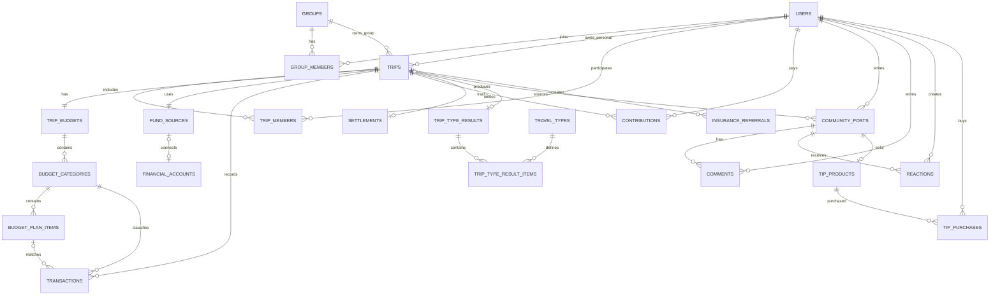

# TripPot ERD v1

| 항목 | 내용 |
|---|---|
| 문서 상태 | 확정 초안 |
| 작성일 | 2026-08-27 |
| 변경 사유 | migrations 구현과 연결할 데이터 구조 최초 정의 |
| 이전 버전 | 없음 |

## 1. 모델링 원칙

- 모든 PK는 UUID를 권장한다.
- 금액은 부동소수점이 아닌 최소 화폐단위 정수(`BIGINT`)로 저장한다.
- 시간은 UTC 저장 후 화면에서 로컬 시간으로 표시한다.
- 핵심 엔티티는 `created_at`, `updated_at`을 가진다.
- 사용자 삭제가 필요한 데이터는 즉시 물리 삭제보다 상태값 또는 `deleted_at`을 우선 검토한다.

## 2. ERD

## 3. 핵심 테이블

### users

`id`, `name`, `profile_image_url`, `auth_provider`, `auth_provider_user_id`, `notification_settings_json`

### groups / group_members

- `groups`: `id`, `name`, `owner_user_id`, `status`
- `group_members`: `group_id`, `user_id`, `role`, `status`, `joined_at`
- `role`: `OWNER`, `MEMBER`

### trips / trip_members

- `trips`: `id`, `owner_type`, `owner_user_id`, `group_id`, `destination`, `start_date`, `end_date`, `headcount`, `travel_style_json`, `status`, `currency`
- `owner_type`: `PERSONAL`, `GROUP`
- `status`: `PLANNING`, `TRAVELING`, `ENDED`, `SETTLED`, `DELETED`
- `trip_members`: `trip_id`, `user_id`, `display_name`, `status`

제약: `PERSONAL`이면 `owner_user_id` 필수, `GROUP`이면 `group_id` 필수다.

### trip_budgets / budget_categories / budget_plan_items

- `trip_budgets`: `trip_id`, `method`, `target_amount`, `recommended_amount`, `per_person_amount`, `recommendation_basis_json`, `confirmed_at`
- `method`: `RECOMMENDED`, `USER_DEFINED`
- `budget_categories`: `id`, `trip_budget_id`, `category_code`, `expected_amount`, `prepared_amount`, `actual_amount`, `sort_order`, `enabled`
- `category_code`: `AIRFARE`, `LODGING`, `FOOD`, `TRANSPORT`, `ACTIVITY`, `SHOPPING`, `INSURANCE`, `CONTINGENCY`
- `budget_plan_items`: `id`, `budget_category_id`, `name`, `expected_amount`, `actual_amount`, `status`, `sort_order`

카테고리·계획 항목의 `actual_amount`는 연결된 거래 합계로 재계산할 수 있어야 한다.

### fund_sources / financial_accounts

- `fund_sources`: `trip_id`, `source_type`, `current_amount`, `last_synced_at`, `switched_from_manual_at`
- `source_type`: `ACCOUNT`, `MANUAL`, `ZERO`, `MOCK`
- `financial_accounts`: `id`, `group_id`, `institution_code`, `masked_account_number`, `current_balance`, `is_mock`, `connected_at`, `disconnected_at`

정책: `MANUAL/ZERO → ACCOUNT/MOCK` 전환 시 기존 금액과 계좌 잔액을 더하지 않고 `current_amount`를 계좌 잔액으로 대체한다.

### transactions

`id`, `trip_id`, `financial_account_id`, `budget_category_id`, `budget_plan_item_id`, `source_type`, `transaction_type`, `occurred_at`, `name`, `amount`, `category_method`, `category_confidence`, `raw_reference`, `deleted_at`

- `source_type`: `ACCOUNT`, `MANUAL`, `MOCK`
- `transaction_type`: `DEPOSIT`, `WITHDRAWAL`
- `category_method`: `AUTO`, `USER`, `NONE`
- 입금은 예산의 실제 사용금액에 포함하지 않는다.
- 출금만 카테고리/계획 항목의 실제 사용금액에 합산한다.

### contributions

`id`, `trip_id`, `user_id`, `expected_amount`, `paid_amount`, `status`, `source_type`

- 선택 기능이 비활성화된 여행은 행을 만들지 않아도 된다.
- `status`: `UNPAID`, `PARTIAL`, `PAID`

### settlements

`id`, `trip_id`, `target_amount`, `actual_amount`, `difference_amount`, `difference_rate`, `category_snapshot_json`, `confirmed_at`

결산 확정 시점의 값을 스냅샷으로 보존한다.

### travel_types / trip_type_results / trip_type_result_items

- `travel_types`: `id`, `code`, `name`, `description`, `image_key`, `rule_version`, `active`
- `trip_type_results`: `id`, `trip_id`, `primary_type_id`, `basis_summary_json`, `generated_at`, `rule_version`
- `trip_type_result_items`: `trip_type_result_id`, `travel_type_id`, `rank`, `score`, `evidence_json`

대표 유형은 `primary_type_id`, 복수 보조 특성은 result items로 저장한다.

### community_posts / comments / reactions

- `community_posts`: `id`, `author_user_id`, `trip_id`, `post_type`, `title`, `content`, `status`, `published_at`
- `post_type`: `POST`, `FREE_TIP`, `PAID_TIP`, `TYPE_SHARE`
- `comments`: `id`, `post_id`, `author_user_id`, `content`, `status`
- `reactions`: `post_id`, `user_id`, `reaction_type`; v1은 `LIKE`

### tip_products / tip_purchases

- `tip_products`: `post_id`, `price_amount`, `currency`, `sales_status`
- `tip_purchases`: `id`, `tip_product_id`, `buyer_user_id`, `amount`, `status`, `purchased_at`
- 실제 결제·환불·정산 모델은 결제 사업자 선정 후 확장한다.

### insurance_referrals

`id`, `trip_id`, `user_id`, `partner_code`, `status`, `clicked_at`, `conversion_at`, `external_reference`

`status`: `CLICKED`, `QUOTE_COMPLETED`, `PURCHASE_COMPLETED`; 실제 수집 가능 범위는 제휴 계약에 따른다.

## 4. migrations 권장 순서

1. users
2. groups, group_members
3. trips, trip_members
4. trip_budgets, budget_categories, budget_plan_items
5. financial_accounts, fund_sources
6. transactions, contributions
7. settlements
8. travel_types, trip_type_results, trip_type_result_items
9. community_posts, comments, reactions
10. tip_products, tip_purchases
11. insurance_referrals

마이그레이션과 본 문서가 어긋나면 스키마를 임의 변경하지 말고 차이를 먼저 보고한다.

