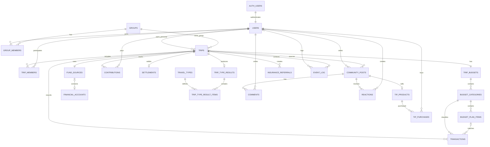

# TripPot ERD v3

| 항목 | 내용 |
|---|---|
| 문서 상태 | 확정 초안 |
| 작성일 | 2026-08-28 |
| 변경 사유 | **RLS 정책만으로는 테이블에 접근할 수 없다**는 사실 반영. `anon` 역할에 GRANT 가 별도로 필요하다. v2 §6-1 의 "`anon` key만 있으면 모든 행을 읽고 쓸 수 있다" 는 서술이 실제와 달라 TRIP-01 구현이 막혔다 |
| 이전 버전 | `05_ERD_v2.md` |

**이 문서와 마이그레이션이 어긋나면 마이그레이션이 맞다.** 문서를 고쳐서 맞춘다.
스키마를 바꿔야 하면 **작업을 멈추고 사람에게 요청한다.** (`CLAUDE.md` 1장 — DB 담당자만 새 Migration 추가)

---

## 0. v2 → v3 변경 요약

| # | 변경 | v2 | v3 |
|---|---|---|---|
| 1 | **테이블 접근 권한(GRANT)** | **언급 없음** | 6장에 절 추가. RLS 와 별개로 `anon`/`authenticated` GRANT 가 필요하다 |
| 2 | §6-1 서술 | "`anon` key만 있으면 모든 행을 읽고 쓸 수 있다" | **사실과 달랐다.** GRANT 가 없어 한 행도 읽지 못했다. 수정 |
| 3 | migrations 목록 | 초기 스키마 1개 | `20260828000001_grant_anon_access.sql` 추가 |

---

## 0-1. v1 → v2 변경 요약

| # | 변경 | v1 | v2 |
|---|---|---|---|
| 1 | `budget_categories` 금액 칼럼 | `expected_amount` / `prepared_amount` / `actual_amount` | `recommended_amount` / `personalized_amount` / `planned_amount` / `applied_source` / `prepared_amount` / `actual_amount` |
| 2 | `event_log` 테이블 | 없음 | 추가 (Analytics 3중 기록의 자체 저장소) |
| 3 | `settlements.difference_rate` | 비율 (타입 미지정) | `difference_rate_bp` — basis point 정수 |
| 4 | `users.id` | 독립 PK | `auth.users(id)` 참조 |
| 5 | 상태값 타입 | 미지정 | enum 타입이 아니라 `text` + `CHECK` |
| 6 | migrations 순서 | 11단계 | `event_log` 포함 12단계 |
| 7 | FK `ON DELETE` 정책 | 없음 | 전 외래키에 명시 |
| 8 | 인덱스 | 없음 | 36개 명시 |
| 9 | **RLS** | **한 줄도 없음** | 23개 테이블 전체 활성 + 정책 |
| 10 | `created_at`/`updated_at` | 원칙만 언급 | 트리거(`set_updated_at()`)로 자동 갱신 |
| 11 | PK/UNIQUE 제약 | 일부 누락 | `trip_budgets.trip_id` UNIQUE, `reactions` 복합 PK 등 명시 |

---

## 1. 모델링 원칙

- 모든 PK는 UUID다. `gen_random_uuid()` 로 생성한다.
- **금액은 전부 `bigint` 원 단위 정수다.** `numeric` / `float` 를 쓰지 않는다.
  비율도 소수점을 피해 basis point 정수로 저장한다. (3장 `settlements` 참조)
- **여행 시작일·종료일은 `date`** 다. 시간 정보가 불필요하기 때문이다.
  그 외 모든 시각은 `timestamptz` 이며 UTC로 저장하고 화면에서 KST로 변환한다.
- 핵심 엔티티는 `created_at`, `updated_at` 을 가진다. `updated_at` 은 트리거로 자동 갱신된다.
- 사용자 삭제가 필요한 데이터는 물리 삭제보다 상태값 또는 `deleted_at` 을 우선 검토한다.
- **거래 금액은 원화 기준이다.** `currency` 는 `'KRW'` 고정, 환율 변환은 `[Future]`. (`CLAUDE.md` 3장)

### 1-1. 상태값은 enum 타입이 아니라 text + CHECK — [변경 5]

```sql
status text not null default 'PLANNING'
  check (status in ('PLANNING','TRAVELING','ENDED','SETTLED','DELETED'))
```

**이유:** MVP 기간에 열거값 추가가 잦을 것으로 보고, `ALTER TYPE` 없이 마이그레이션할 수 있게 했다.

**대가:** Supabase 생성 타입에서 이 칼럼들이 전부 `string` 이 된다. `'PLANNIG'` 같은 오타를
TypeScript가 잡지 못하고 런타임 DB 에러로만 드러난다.
→ 그래서 **`lib/constants/status.ts` 의 상수만 쓴다. 문자열 리터럴 금지.** (`CLAUDE.md` 6장)

CHECK 제약이 걸린 칼럼은 13개다: `status`(10개 테이블), `source_type`(3개 테이블),
`owner_type`, `role`, `method`, `category_code`, `applied_source`, `transaction_type`,
`category_method`, `post_type`, `reaction_type`, `sales_status`, `env`.

### 1-2. updated_at 트리거 — [변경 10]

```sql
create function public.set_updated_at() returns trigger ...
create trigger <table>_set_updated_at before update on public.<table>
  for each row execute function public.set_updated_at();
```

`updated_at` 을 애플리케이션에서 직접 넣지 않는다. DB가 갱신한다.

---

## 2. ERD



---

## 3. 핵심 테이블

### users — [변경 4]

`id`, `name`, `profile_image_url`, `auth_provider`, `auth_provider_user_id`,
`notification_settings_json`, `deleted_at`, `created_at`, `updated_at`

```sql
id uuid primary key references auth.users (id) on delete cascade
```

**`id` 가 Supabase `auth.users(id)` 를 그대로 참조한다.**
이렇게 두면 RLS 정책에서 `auth.uid() = users.id` 로 바로 비교할 수 있다.
독립 PK로 두면 정책마다 매핑 테이블을 한 번 더 타야 한다.

→ **Seed 데이터를 넣으려면 `auth.users` 행이 먼저 있어야 한다.** (`supabase/seed.sql` 1절 참조)

### groups / group_members

- `groups`: `id`, `name`, `owner_user_id`, `status`, `created_at`, `updated_at`
- `group_members`: `id`, `group_id`, `user_id`, `role`, `status`, `joined_at`, `created_at`, `updated_at`
- `role`: `OWNER`, `MEMBER` / `status`: `ACTIVE`, `INVITED`, `LEFT`
- `groups.status`: `ACTIVE`, `ARCHIVED`, `DELETED`
- 제약: `unique (group_id, user_id)` — 한 사람이 같은 모임에 두 번 들어가지 않는다.

### trips / trip_members

- `trips`: `id`, `owner_type`, `owner_user_id`, `group_id`, `destination`, `start_date`, `end_date`,
  `headcount`, `travel_style_json`, `status`, `currency`, `created_at`, `updated_at`
- `owner_type`: `PERSONAL`, `GROUP`
- `status`: `PLANNING`, `TRAVELING`, `ENDED`, `SETTLED`, `DELETED`
- `trip_members`: `id`, `trip_id`, `user_id`(nullable), `display_name`, `status`

제약:

```sql
constraint trips_owner_shape check (
  (owner_type = 'PERSONAL' and owner_user_id is not null and group_id is null)
  or (owner_type = 'GROUP' and group_id is not null)
)
constraint trips_date_order check (start_date <= end_date)
```

`start_date` / `end_date` 는 `date` 다. `timestamptz` 가 아니다.

⚠️ `travel_style_json` 은 `jsonb` 라 **CHECK 제약이 없다.** 안의 `style` 값
(`budget`/`standard`/`comfort`/`luxury`)은 예산 추천 배수의 입력값인데 DB가 막아주지 않는다.
**`lib/constants/status.ts` 의 `TRAVEL_STYLE` 상수가 유일한 방어선이다.**

### trip_budgets / budget_categories / budget_plan_items — [변경 1]

- `trip_budgets`: `id`, `trip_id`(**UNIQUE**), `method`, `target_amount`, `recommended_amount`,
  `per_person_amount`, `recommendation_basis_json`, `confirmed_at`, `created_at`, `updated_at`
- `method`: `RECOMMENDED`, `USER_DEFINED`
- `confirmed_at` 이 `null` 이면 **예산 미확정** 상태다.
- `budget_categories`: `id`, `trip_budget_id`, `category_code`,
  **`recommended_amount`, `personalized_amount`, `planned_amount`, `applied_source`,**
  `prepared_amount`, `actual_amount`, `sort_order`, `enabled`, `created_at`, `updated_at`
- `category_code`: `AIRFARE`, `LODGING`, `FOOD`, `TRANSPORT`, `ACTIVITY`, `SHOPPING`, `INSURANCE`, `CONTINGENCY`
- 제약: `unique (trip_budget_id, category_code)`
- `budget_plan_items`: `id`, `budget_category_id`, `name`, `expected_amount`, `actual_amount`,
  `status`, `sort_order`, `created_at`, `updated_at` / `status`: `PLANNED`, `DONE`, `CANCELED`

#### 예산 금액 3칼럼 규칙 — 매우 중요

`CLAUDE.md` 4장과 동일하다. 하나로 합치지 않는다.

| Column | 의미 | 변경 규칙 | Null |
|---|---|---|---|
| `recommended_amount` | 시스템 기본 추천 원본 | **불변. 최초 생성 후 덮어쓰지 않는다** | NOT NULL |
| `personalized_amount` | 과거 소비 반영 개인화 추천 | 개인화 재계산 시에만 | **nullable** |
| `planned_amount` | 사용자가 최종 확정한 값 | **사용자 확정 행동을 통해서만** | NOT NULL |
| `applied_source` | `planned_amount` 의 출처 | `default` / `personalized` / `user` | NOT NULL |
| `prepared_amount` | 가상 여행 금고 배분액 | 자금 배분 시 | NOT NULL |
| `actual_amount` | 출금 거래 합계 | 거래 변경 시 재계산 | NOT NULL |

- **AI·추천 로직은 `personalized_amount` 생성까지만 한다.** `planned_amount` 를 직접 쓰지 않는다.
  추천 + 근거 제시 → 사용자 확인/수정 → 사용자 최종 확정 순서다.
- `personalized_amount` 만 nullable인 이유: 개인화 계산 **전**과 **0원 추천**을 구분해야 한다.
- 코드에서는 `BudgetCategoryUpdate` 타입이 `recommended_amount` 를 `Omit` 으로 제외해
  타입 레벨에서 덮어쓰기를 막는다. (`lib/supabase/queries/budgets.ts`)

**v1의 `expected_amount` 는 `planned_amount` 와 의미가 중복되어 제거했다.**
이름이 두 개면 어느 쪽이 진짜인지 팀이 헷갈린다.

**이유:** 추천 원본이 사라지면 기본 추천 정확도, 사용자가 자주 수정하는 카테고리,
개인화 추천 효과를 영원히 측정할 수 없다. 프로젝트의 핵심 가설 검증이 여기 걸려 있다.

### fund_sources / financial_accounts

- `fund_sources`: `id`, `trip_id`(**UNIQUE**), `financial_account_id`, `source_type`,
  `current_amount`, `last_synced_at`, `switched_from_manual_at`, `created_at`, `updated_at`
- `source_type`: `ACCOUNT`, `MANUAL`, `ZERO`, `MOCK`
- `financial_accounts`: `id`, `group_id`, `institution_code`, `masked_account_number`,
  `current_balance`, `is_mock`, `connected_at`, `disconnected_at`, `created_at`, `updated_at`

정책: `MANUAL/ZERO → ACCOUNT/MOCK` 전환 시 기존 금액과 계좌 잔액을 **더하지 않고**
`current_amount` 를 계좌 잔액으로 **대체**한다. `current_amount` 는 항상 단일 소스 기준이다.

### transactions

`id`, `trip_id`, `financial_account_id`, `budget_category_id`, `budget_plan_item_id`,
`source_type`, `transaction_type`, `occurred_at`, `name`, `amount`, `category_method`,
`category_confidence`, `raw_reference`(jsonb), `deleted_at`, `created_at`, `updated_at`

- `source_type`: `ACCOUNT`, `MANUAL`, `MOCK` (`ZERO` 없음)
- `transaction_type`: `DEPOSIT`, `WITHDRAWAL`
- `category_method`: `AUTO`, `USER`, `NONE`
- **입금(`DEPOSIT`)은 예산 실제 사용금액에 포함하지 않는다.**
- **출금(`WITHDRAWAL`)만** 카테고리/계획 항목의 `actual_amount` 에 합산한다.
- MVP는 1 거래 = 1 카테고리다. 다만 향후 분할 매핑을 막는 구조로 두지 않았다.

### contributions

`id`, `trip_id`, `user_id`, `expected_amount`, `paid_amount`, `status`, `source_type`,
`created_at`, `updated_at` / `status`: `UNPAID`, `PARTIAL`, `PAID`

선택 기능이 비활성화된 여행은 행을 만들지 않아도 된다.

### settlements — [변경 3]

`id`, `trip_id`(**UNIQUE**), `target_amount`, `actual_amount`, `difference_amount`,
**`difference_rate_bp`**, `category_snapshot_json`, `confirmed_at`, `created_at`, `updated_at`

**`difference_rate` → `difference_rate_bp` 로 이름과 단위를 바꿨다.**

```
difference_rate_bp  integer   basis point(만분율) 정수
                              1250 = 12.50%,  -200 = -2.00%
```

**이유:** 비율을 실수로 저장하면 "금액·비율에 소수점 연산을 하지 않는다"는 규칙과 충돌한다.
`0.1 + 0.2 != 0.3` 문제를 결산 숫자에서 만들지 않기 위해 정수로 저장한다.

결산 확정 시점의 카테고리별 값을 `category_snapshot_json` 에 스냅샷으로 보존한다.
이후 예산이 바뀌어도 결산 결과는 변하지 않는다.

### travel_types / trip_type_results / trip_type_result_items

- `travel_types`: `id`, `code`(UNIQUE), `name`, `description`, `image_key`, `rule_version`, `active`
- `trip_type_results`: `id`, `trip_id`(**UNIQUE**), `primary_type_id`, `basis_summary_json`,
  `generated_at`, `rule_version`
- `trip_type_result_items`: `id`, `trip_type_result_id`, `travel_type_id`, `rank`, `score`, `evidence_json`

⚠️ **여행 유형 목록은 아직 확정되지 않았다.** `travel_types.code` 에 들어갈 값
(현재 `lib/constants/status.ts` 의 `SPENDING_PROFILE_TYPE` 6개)은 임시값이고,
산출 방식(규칙 기반 / AI 활용)도 미정이다. TYPE-01 화면은 이 때문에 고도화로 미뤄졌다.
(`04_화면목록_v3.md` 참조)

### community_posts / comments / reactions

- `community_posts`: `id`, `author_user_id`, `trip_id`, `post_type`, `title`, `content`,
  `status`, `published_at` / `post_type`: `POST`, `FREE_TIP`, `PAID_TIP`, `TYPE_SHARE`
  / `status`: `DRAFT`, `PUBLISHED`, `HIDDEN`, `DELETED`
- `comments`: `id`, `post_id`, `author_user_id`, `content`, `status`
- `reactions`: `post_id`, `user_id`, `reaction_type` — **복합 PK `(post_id, user_id, reaction_type)`**
  / v1은 `LIKE` 하나뿐이다.

### tip_products / tip_purchases

- `tip_products`: `id`, `post_id`(**UNIQUE**), `price_amount`, `currency`, `sales_status`
- `tip_purchases`: `id`, `tip_product_id`, `buyer_user_id`, `amount`, `status`, `purchased_at`
- `sales_status`: `ON_SALE`, `PAUSED`, `ENDED` / `status`: `PENDING`, `COMPLETED`, `CANCELED`, `REFUNDED`
- 실제 결제·환불·정산 모델은 결제 사업자 선정 후 확장한다.

### insurance_referrals

`id`, `trip_id`, `user_id`, `partner_code`, `status`, `clicked_at`, `conversion_at`, `external_reference`
/ `status`: `CLICKED`, `QUOTE_COMPLETED`, `PURCHASE_COMPLETED`

외부 이동 후는 추적할 수 없다. 클릭이 관측 가능한 마지막 지점이다.

### event_log — [변경 2] v1에 없던 테이블

`id`, `user_id`, `anon_id`, `trip_id`, `event_name`, `params`(jsonb), `env`, `created_at`

Analytics 3중 기록(Amplitude / Firebase / event_log)의 **자체 저장소**다.
SQL 조인으로 분석 리포트의 실제 근거가 된다. (`06_이벤트로그정의서_v1.md` 2장)

```sql
env text not null default 'production' check (env in ('development','production'))
constraint event_log_identity check (user_id is not null or anon_id is not null)
```

- **`lib/analytics/track.ts` 내부에서만 INSERT 한다.** 화면·컴포넌트에서 직접 INSERT 금지. (`CLAUDE.md` 1장)
- 로그인 전 이벤트는 `anon_id` 로 기록하고 로그인 시 `user_id` 와 매핑한다.
  둘 다 없으면 전환율의 분모를 계산할 수 없으므로 CHECK로 막았다.
- `user_id` / `trip_id` 는 **`ON DELETE SET NULL`** 이다. 사용자나 여행이 지워져도 로그는 남는다.
  분석 근거가 사라지면 안 되기 때문이다.

---

## 4. FK ON DELETE 정책 — [변경 7]

v1에 없던 항목이다. 삭제 전파를 잘못 잡으면 분석 데이터가 통째로 사라진다.

| 정책 | 대상 | 이유 |
|---|---|---|
| **CASCADE** | `users`←`auth.users` / `groups.owner_user_id` / `group_members.*` / `trips.owner_user_id`·`group_id` / `trip_members.*` / `trip_budgets.trip_id` / `budget_categories.trip_budget_id` / `budget_plan_items.budget_category_id` / `financial_accounts.group_id` / `fund_sources.trip_id` / `transactions.trip_id` / `contributions.*` / `settlements.trip_id` / `trip_type_results.trip_id` / `trip_type_result_items.trip_type_result_id` / `community_posts.author_user_id` / `comments.*` / `reactions.*` / `tip_products.post_id` / `insurance_referrals.trip_id` | 상위가 사라지면 존재 의미가 없는 하위 데이터 |
| **SET NULL** | `fund_sources.financial_account_id` / `transactions.financial_account_id`·`budget_category_id`·`budget_plan_item_id` / `trip_type_results.primary_type_id` / `trip_type_result_items.travel_type_id` / `community_posts.trip_id` / `tip_purchases.buyer_user_id` / `insurance_referrals.user_id` / **`event_log.user_id`·`trip_id`** | 상위가 사라져도 **기록 자체는 남아야** 하는 것 |
| **RESTRICT** | `tip_purchases.tip_product_id` | 구매 이력은 정산 근거다. 상품 삭제로 사라지면 안 된다 |

특히 **거래는 남기고 분류만 해제**할 수 있어야 하므로
`transactions.budget_category_id` 는 CASCADE가 아니라 SET NULL이다.

**Seed의 멱등성이 이 정책 위에 서 있다.** `delete from public.users where id in (...)` 한 줄로
모임·여행·예산·거래·결산이 전부 정리되고, `event_log` 만 남는다. (`supabase/seed.sql`)

---

## 5. 인덱스 — [변경 8]

총 36개다. 자주 조회하는 외래키와 정렬 칼럼에 건다.

| 축 | 인덱스 |
|---|---|
| `trip_id` | `trip_members`, `trip_budgets`, `fund_sources`, `transactions`, `contributions`, `settlements`, `trip_type_results`, `insurance_referrals`, `community_posts`, `event_log` |
| `group_id` | `groups(owner_user_id)`, `group_members`, `trips`, `financial_accounts` |
| `budget_id` 계열 | `budget_categories(trip_budget_id)`, `budget_plan_items(budget_category_id)`, `transactions(budget_category_id)`, `transactions(budget_plan_item_id)` |
| `user_id` | `group_members`, `trip_members`, `trips`, `contributions`, `insurance_referrals`, `community_posts`, `tip_purchases`, `event_log` |
| 복합·정렬 | `transactions(trip_id, occurred_at desc)`, `community_posts(status, published_at desc)`, `event_log(event_name, created_at desc)`, `event_log(created_at desc)`, `trips(status)` |

---

## 6. RLS — [변경 9] v1에 한 줄도 없던 항목

**23개 테이블 전부 `enable row level security` 가 걸려 있다.**

### 6-0. RLS 정책만으로는 접근되지 않는다 — GRANT 가 별도로 필요하다 — [변경 1·2]

**이 절을 먼저 읽는다. v2 에서 빠져 있어 실제로 구현이 막혔던 지점이다.**

RLS 정책과 GRANT 는 서로 다른 장치이고, **둘 다 있어야 접근된다.**

| | 무엇을 정하는가 | 없으면 |
|---|---|---|
| **GRANT** | 그 테이블에 **접근할 수 있는가** (권한 검사) | `42501 permission denied` — RLS 정책까지 가보지도 못한다 |
| **RLS 정책** | 그 테이블의 **어떤 행을** 볼 수 있는가 (행 필터) | 접근은 되지만 행이 0건이거나 전부 열린다 |

검사 순서상 **GRANT 가 먼저**다. `dev_open_all` 이 `using (true)` 로 모든 행을 열어두어도,
GRANT 가 없으면 아무것도 읽지 못한다.

초기 스키마(`20260827000001_init_schema.sql`)에는 GRANT 문이 한 줄도 없었다.
그래서 RLS 를 전부 개방해 두었는데도 앱의 모든 조회가 이렇게 실패했다.

```json
{"code": "42501",
 "message": "permission denied for table group_members",
 "hint": "Grant the required privileges to the current role with:
          GRANT SELECT ON public.group_members TO anon;"}
```

Supabase 대시보드로 만든 테이블에는 GRANT 가 자동으로 붙지만,
**마이그레이션 SQL 로 만든 테이블에는 붙지 않는다.** 이것이 원인이다.

해결은 `supabase/migrations/20260828000001_grant_anon_access.sql` 이다.

```sql
grant usage on schema public to anon, authenticated;
grant select, insert, update, delete on all tables    in schema public to anon, authenticated;
grant usage, select                  on all sequences in schema public to anon, authenticated;

-- 앞으로 만들 테이블에도 적용되게
alter default privileges in schema public
  grant select, insert, update, delete on tables to anon, authenticated;
alter default privileges in schema public
  grant usage, select on sequences to anon, authenticated;
```

⚠️ `alter default privileges` 는 **그 문장을 실행한 역할이 만든 객체**에만 적용된다.
다른 역할로 테이블을 만들면 적용되지 않는다. 새 테이블이 또 `42501` 로 막히면
`all tables` GRANT 를 새 마이그레이션으로 다시 실행한다.

⚠️ 이 GRANT 는 **개발용이며 `dev_open_all` 정책과 짝이다.**
실서비스 배포 시 RLS 정책 교체와 **함께** 범위를 재검토한다. (6-2, 6-5)

**RLS 오류로 보이는 것이 사실 GRANT 문제인 경우가 있다.**
`permission denied for table` 이면 GRANT, 행이 0건이면 RLS 정책을 본다.
증상이 비슷해 헷갈리기 쉬우니 에러 코드로 구분한다.

### 6-1. 현재 상태 — 개발용 개방 정책은 임시다

```sql
create policy "dev_open_all" on public.<table> for all using (true) with check (true);
```

⚠️ **현재 정책은 MVP 개발 편의용으로 전부 개방되어 있다.**
`anon` key 와 위 GRANT 가 함께 있으면 모든 행을 읽고 쓸 수 있다.
**이 상태로 실서비스에 나가면 안 된다.**

> v2 는 이 자리에 "`anon` key만 있으면 모든 행을 읽고 쓸 수 있다" 고 적었다.
> **사실과 달랐다.** GRANT 가 없어 한 행도 읽지 못하는 상태였고,
> 이 서술 때문에 원인을 RLS 쪽에서 찾느라 시간을 썼다. (6-0)

### 6-2. 실서비스 정책 — 배포 전 반드시 적용

**실서비스 정책은 마이그레이션 SQL 파일 하단에 주석으로 들어 있다.**
(`supabase/migrations/20260827000001_init_schema.sql` — "실서비스 정책" 절)

배포 전에 `dev_open_all` 을 `drop policy` 하고 주석의 정책으로 교체한다. 골자는 다음과 같다.

| 대상 | 정책 |
|---|---|
| `users` | 본인 행만 (`id = auth.uid()`) |
| `groups` | 소유자 또는 `ACTIVE` 멤버만 |
| `trips` 및 `trip_id` 보유 테이블 | `can_access_trip(trip_id)` — 본인 여행 또는 소속 모임 여행 |
| `budget_categories` / `budget_plan_items` / `trip_type_result_items` | 상위 테이블을 타고 올라가 `can_access_trip` |
| `financial_accounts` | 소속 모임의 계좌만 |
| `community_posts` / `comments` / `reactions` | 공개글은 모두 읽기, 쓰기는 작성자만 |
| `travel_types` | 마스터 데이터. `active = true` 읽기 전용 공개 |
| `tip_purchases` | 구매자 본인만 |
| `event_log` | 앱은 INSERT만. **SELECT 정책을 만들지 않는다** (조회는 서버·대시보드에서만) |

### 6-3. RLS 오류를 Disable로 해결하지 않는다

**`CLAUDE.md` 1장:** RLS 임의 Disable 금지. RLS 오류는 **정책을 고쳐서** 해결한다.
막히면 사람에게 알린다.

→ 현재 스키마가 RLS를 끄지 않고 **Enable + 느슨한 정책**으로 둔 이유가 이것이다.
끄면 나중에 켤 때 어느 테이블이 빠졌는지 알 수 없다.

### 6-4. service_role Key

앱은 `anon` key만 쓴다. `service_role` key를 앱에 두지 않는다.
관리자 권한 동작은 Edge Function을 경유한다. (`CLAUDE.md` 1장)

### 6-5. 배포 전 체크리스트 — [변경 1]

```
[ ] dev_open_all 정책 전부 drop
[ ] 20260827000001 하단 "실서비스 정책" 의 RLS 정책으로 교체
[ ] 20260828000001 의 GRANT 범위 재검토
    · anon 에게 INSERT/UPDATE/DELETE 가 필요한가
      (로그인 후 동작이면 authenticated 만으로 충분하다)
    · event_log 는 앱에서 INSERT 만 한다. SELECT 를 회수할지 검토 (6-2)
[ ] alter default privileges 도 같은 기준으로 다시 건다
```

**RLS 정책만 교체하고 GRANT 를 그대로 두면 권한이 넓은 채로 배포된다.**
두 가지는 항상 같이 검토한다.

---

## 7. migrations 권장 순서 — [변경 6]

1. `users` (← `auth.users` 선행 필요)
2. `groups`, `group_members`
3. `trips`, `trip_members`
4. `trip_budgets`, `budget_categories`, `budget_plan_items`
5. `financial_accounts`, `fund_sources`
6. `transactions`, `contributions`
7. `settlements`
8. `travel_types`, `trip_type_results`, `trip_type_result_items`
9. `community_posts`, `comments`, `reactions`
10. `tip_products`, `tip_purchases`
11. `insurance_referrals`
12. **`event_log`** ← v2 추가
13. RLS 활성 + 정책 (전 테이블 생성 후 마지막)
14. **GRANT (`anon` / `authenticated`)** ← v3 추가

`set_updated_at()` 함수는 1번보다 먼저 만든다.

⚠️ **14번을 빠뜨리면 13번까지 다 해도 앱에서 아무것도 읽지 못한다.** (6-0)

### 7-1. 적용된 마이그레이션 — [변경 3]

| 파일 | 내용 |
|---|---|
| `20260827000001_init_schema.sql` | 초기 스키마 23개 테이블 + 인덱스 + RLS 활성 + `dev_open_all` 정책 |
| `20260828000001_grant_anon_access.sql` | `anon`/`authenticated` GRANT + `alter default privileges`. **RLS 와 짝이다** (6-0) |

**마이그레이션과 본 문서가 어긋나면 스키마를 임의 변경하지 말고 차이를 먼저 보고한다.**
