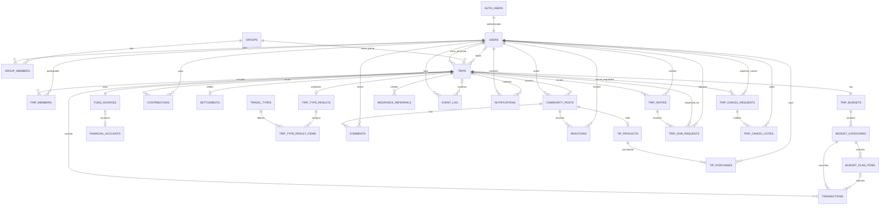

# TripPot ERD v7

| 항목 | 내용 |
|---|---|
| 문서 상태 | **확정** (migration 기준) |
| 작성일 | 2026-09-18 |
| 기준 migration | `20260918000001_notification_copy_member_joined.sql` (총 **37개**) |
| 기준 코드 | `develop` `eeeb2eb` (PR #154 merge 시점 · 2026-09-18). 코드 대조는 `fef9c86`(PR #152) 에서 했고, 그 뒤 팀원 PR #153·#154 는 앱 코드만 바꿔 ERD 에 영향 없음 |
| 변경 사유 | v6(2026-09-04) 이후 적용된 migration 26개 반영 — 초대·참여요청·취소 표, 회원탈퇴, 알림센터, RLS/GRANT 전환 완료, 서버 함수(RPC) 전수, cron·Storage |
| 이전 버전 | `05_ERD_v6.md` |

**이 문서와 마이그레이션이 어긋나면 마이그레이션이 맞다.** 문서를 고쳐서 맞춘다.
스키마를 바꿔야 하면 **작업을 멈추고 사람에게 요청한다.** (`CLAUDE.md` 1장 — DB 담당자만 새 Migration 추가)

---

## 0. 이번 판(v7)에 대하여

v6(2026-09-04 · migration 11개) 이후 **26개 migration** 이 더 적용됐다(`20260907000001` ~ `20260918000001`).
여행 초대·참여 요청·취소 표가 생겼고, 회원탈퇴 유예가 붙었고, 알림센터가 서버 함수 안에서 알림을 만들게 됐고,
무엇보다 **모든 표의 `dev_open_all` 이 제거되어 v6 의 §6 "현재 상태" 서술은 전부 과거형이 됐다.**

이 문서는 v6 의 장 구조를 유지하고, **바뀌지 않은 내용은 그대로 복사**했다.
바뀐 곳마다 아래 블록을 붙여 v6 의 기록을 보존한다. (`CLAUDE.md` 1-1)

> **🔁 변경 (v6 → v7)**
> - **이전(v6)**: … / **문제정의**: … / **의사결정**: … · migration · PR/일자 / **상태**: 확정 / [검토 필요]

**근거는 migration 파일과 `docs/14 · 15 · 16 · 18` 뿐이다.** 원격 DB 를 조회하지 않았다.
migration 만으로 확인되지 않는 것은 **"미확인"** 으로 적었다. 추측하지 않았다.

---

## 0-1. v6 → v7 변경 요약

| # | 대상 | 무엇이 바뀌었나 | migration |
|---|---|---|---|
| 1 | `users` | `english_name text` 추가(여권 영문 이름 · 선택값) | `20260915000001` |
| 2 | `users` | `withdrawal_requested_at timestamptz` 추가 · **`users_id_fkey`(auth.users cascade) 제거** · anon 쓰기 GRANT 회수 | `20260917000001` |
| 3 | `transactions` | `refund_status` (`NONE`/`PENDING`/`REFUNDED`/`CANCELED`) + partial index — v6 7-1 에 "다음 판에서 정리" 로 밀려 있던 것 | `20260901000002` |
| 4 | `trips.status` | CHECK 5 → **7종** (`CANCEL_PENDING` · `CANCELED` 추가) | `20260909000001`(6종) → `20260910000002`(7종) |
| 5 | `trips` | `leader_user_id` · `pending_group_name` · `canceled_at` · `canceled_by` · `cancel_reason` · `canceled_fund_snapshot_json` 추가 | `20260910000001` · `20260909000001` · `20260910000002` |
| 6 | `trip_members` | `left_at timestamptz` 추가 | `20260910000001` |
| 7 | 새 표 | `trip_invites` · `trip_join_requests` | `20260910000001` |
| 8 | 새 표 | `trip_cancel_requests` · `trip_cancel_votes` | `20260910000002` |
| 9 | 새 표 | `destination_budget_products` (TRIP-03 근거 상품 캐시 · Edge Function 전용) | `20260907000001` · `20260907000002` |
| 10 | `notifications` | `data jsonb` 추가 · type CHECK 3 → 17 → **18종** · `notifications_invite_received_uniq` · Realtime publication 등록 | `20260910000001`(17) · `20260916000001`(18) |
| 11 | `community_posts` | `destination text` 추가 + 트리거 `community_posts_set_destination`(앱 값 무시 · trips 에서 복사) | `20260917000005` |
| 12 | 서버 함수(RPC) | 2(`set_updated_at` · `can_access_trip`) → **40개** (초대·참여요청 · 나가기·위임·취소 · 알림 helper · 탈퇴 · 접근 helper · 트리거 함수) — 6-10 전수 표 | `20260911000001` ~ `20260918000001` |
| 13 | RLS / GRANT | **모든 표의 `dev_open_all` 제거 완료.** 표별 최소권한 정책 + GRANT 재부여 — 6-9 표 | `20260915000002` · `20260916000002/7/8/10` · `20260917000002/3/5` |
| 14 | 트리거 | `trips_guard_direct_update` — 직접 UPDATE 로 여행장·취소 필드·소유·상태를 못 바꾸게 막는다 | `20260916000008` |
| 15 | pg_cron | `notifications_cleanup_730d`(매일 KST 03:00) · `account_withdrawal_finalize`(매일 KST 03:30) | `20260916000011` · `20260917000001` |
| 16 | Edge Function | `withdrawal-cleanup` — 프로필 이미지 파일 정리 + `finalize_withdrawals()` 호출. **외부 스케줄 필요(사람이 직접)** | `20260917000002`(service_role EXECUTE) |
| 17 | Storage | `profile-images` 쓰기 정책 own-folder 로 전환 · `community-images` 쓰기 정책 own-folder 로 전환 · **`brand-assets` 공개 버킷 신설** | `20260917000002` · `20260917000005` · `20260916000006` |
| 18 | 예산 3칼럼 | `personalized_amount` 계산식 각주(과거 결산 편차 × `recommended_amount`) — 코드 선행 반영 | (코드) `lib/supabase/queries/personalization.ts` |
| 19 | Release Blocker 3블록 | notifications · profile-images · community-images 전부 **전환 완료** 로 상태 갱신 | `20260916000002` · `20260917000002` · `20260917000005` |
| 20 | 인덱스 | 39 → **47개** (초대 2 · 참여요청 2 · 취소요청 2 · 투표 1 · 알림 멱등 1) | 5장 |
| 21 | FK | 새 FK 12개 · `users.id → auth.users` FK **제거** | 4장 |
| 22 | 7-1 적용된 마이그레이션 | 11 → **37개** 전수 표 | 7-1 |

⚠️ 13번이 v7 의 핵심이다. v6 의 §6-1 · §6-5 · 6-6-3 은 **"개발용 개방 상태"** 를 전제로 쓰였고,
그 전제가 사라졌다. 해당 절은 원문을 남기고 변경 블록을 붙였다.

---

## 0. v5 → v6 변경 요약

커뮤니티 글쓰기에서 고른 사진(최대 5장)이 게시하면 버려지고 있었다.
담을 컬럼도, 파일을 둘 bucket 도 없었기 때문이다.
그래서 글 상세에는 `components/community/cover.ts` 의 **더미 이미지**가 대신 그려졌고,
사진을 바꿔도 화면은 그대로인 반면 제목·본문을 고치면 사진이 바뀌는 상태였다.

본문에서 이번 판에 고친 부분은 **`[v6]`** 로 표시했다.

| # | 변경 | v5 | v6 |
|---|---|---|---|
| 1 | `community_posts` | 사진 칼럼 없음 | **`image_urls text[] not null default '{}'` 추가** (3장) |
| 2 | Storage bucket | `profile-images` 하나 | **`community-images` 추가** — 5 MB · public (6-7) |
| 3 | 배포 전 체크리스트 | Release Blocker 2블록 | **`community-images` 블록 추가** — `community_images_dev_*` 3개 전환 (6-5) |
| 4 | 적용된 마이그레이션 | 9개 | **11개** (7-1) |
| 5 | 인덱스 | 39개 | **39개 — 그대로.** 컬럼 추가라 인덱스가 늘지 않는다 (5장) |

⚠️ **3번은 [Release Blocker] 다.** 지금 상태로 배포하면 누구나
**남의 글 사진을 덮어쓰거나 지울 수 있다.** (6-5 · 6-7-3)

---

## 0. v4 → v5 변경 요약

`notifications_type_check` 가 적용되어 v4 에서 사실이 아니게 된 부분만 고쳤다.
그 밖의 내용은 v4 그대로다. 본문에서 이번 판에 고친 부분은 **`[v5]`** 로 표시했다.

| # | 변경 | v4 | v5 |
|---|---|---|---|
| 1 | `notifications.type` CHECK | "현재 원격 DB 에는 없다 · 추가 예정" | **적용됨.** `20260903000001_notifications_type_check.sql` · 허용값 3종 (3장) |
| 2 | 적용된 마이그레이션 | 7개 | **9개** — CHECK 마이그레이션 추가 (7-1) |

---

## 0-2. v3 → v4 변경 요약

본문에서 v4 에 추가한 부분은 **`[v4]`** 로 표시했다.
기존 `[변경 N]` 태그는 v1→v2 · v2→v3 때 붙은 것이라 번호 체계가 다르다. 섞어 읽지 않는다.

이번 판은 **스키마를 바꾸지 않았다.** 이미 `develop` 에 들어와 있는 구조를 문서에 옮겨 적었을 뿐이다.
(`20260902000002_notifications.sql` · `20260902000003_profile_images_storage.sql`)

| # | 변경 | v3 | v4 |
|---|---|---|---|
| 1 | **`notifications` 테이블** | 없음 | 3장에 절 추가. 컬럼 8개 · FK 2개 · 인덱스 1개. 2장 ERD 에도 반영 |
| 2 | `notifications` FK · 인덱스 | — | 4장에 `user_id` CASCADE / `trip_id` SET NULL 추가. 5장에 `(user_id, created_at desc)` 추가 |
| 3 | `notifications` RLS · GRANT | — | 6-1 에 추가. **`dev_open_all` 루프가 아니라 마이그레이션이 직접 만든 정책**이라는 점을 함께 적었다 |
| 4 | **`profile-images` Storage** | **문서에 Storage 개념 자체가 없었다** | 6-6 절 신설. bucket 설정 · 현재 개발용 정책 · 실서비스 예정 정책 |
| 5 | `users.profile_image_url` 과 Storage 의 관계 | 컬럼 이름만 나열 | 3장 `users` 절에 **"파일은 Storage, 위치는 이 컬럼"** 역할 분리와 저장 형식(public URL 전체)을 명시 |
| 6 | **배포 전 Production RLS 전환** | 6-5 체크리스트에 `dev_open_all` · GRANT 만 | 6-5 에 **[Release Blocker]** 두 블록 추가. **P2 나 Future 가 아니다** |
| 7 | 적용된 마이그레이션 목록 | 2개 | 7-1 을 현재 `develop` 기준 7개로 맞췄다 |
| 8 | 인덱스 총수 | 36 | **39** (초기 36 + 모임 목록 설정 1 + 거래 환불 1 + 알림 1) |
| 9 | **MVP notification type** | — | 3장에 확정 3종(`FUND_GOAL_REACHED` · `TRIP_D7` · `SETTLEMENT_READY`) 기록. **DB 에는 아직 CHECK 가 없다는 점을 함께 적었다** |

⚠️ **6-5 의 Release Blocker 는 "나중에 하면 좋은 개선" 이 아니다.**
지금 상태로 외부 사용자에게 배포하면 **다른 사람의 알림을 읽고 지울 수 있고,
다른 사람의 프로필 이미지를 덮어쓰거나 지울 수 있다.**

---

## 0-3. v2 → v3 변경 요약

| # | 변경 | v2 | v3 |
|---|---|---|---|
| 1 | **테이블 접근 권한(GRANT)** | **언급 없음** | 6장에 절 추가. RLS 와 별개로 `anon`/`authenticated` GRANT 가 필요하다 |
| 2 | §6-1 서술 | "`anon` key만 있으면 모든 행을 읽고 쓸 수 있다" | **사실과 달랐다.** GRANT 가 없어 한 행도 읽지 못했다. 수정 |
| 3 | migrations 목록 | 초기 스키마 1개 | `20260828000001_grant_anon_access.sql` 추가 |

---

## 0-4. v1 → v2 변경 요약

| # | 변경 | v1 | v2 |
|---|---|---|---|
| 1 | `budget_categories` 금액 칼럼 | `expected_amount` / `prepared_amount` / `actual_amount` | `recommended_amount` / `personalized_amount` / `planned_amount` / `applied_source` / `prepared_amount` / `actual_amount` |
| 2 | `event_log` 테이블 | 없음 | 추가 (Analytics 3중 기록의 자체 저장소) |
| 3 | `settlements.difference_rate` | 비율 (타입 미지정) | `difference_rate_bp` — basis point 정수 |
| 4 | `users.id` | 독립 PK | `auth.users(id)` 참조 |
| 5 | 상태값 타입 | 미지정 | enum 타입이 아니라 `text` + `CHECK` |
| 6 | migrations 순서 | 11단계 | `event_log` 포함 12단계 |
| 7 | FK `ON DELETE` 정책 | 없음 | 전 외래키에 명시 |
| 8 | 인덱스 | 없음 | 36개 명시 |
| 9 | **RLS** | **한 줄도 없음** | 23개 테이블 전체 활성 + 정책 |
| 10 | `created_at`/`updated_at` | 원칙만 언급 | 트리거(`set_updated_at()`)로 자동 갱신 |
| 11 | PK/UNIQUE 제약 | 일부 누락 | `trip_budgets.trip_id` UNIQUE, `reactions` 복합 PK 등 명시 |

---

## 1. 모델링 원칙

- 모든 PK는 UUID다. `gen_random_uuid()` 로 생성한다.
- **금액은 전부 `bigint` 원 단위 정수다.** `numeric` / `float` 를 쓰지 않는다.
  비율도 소수점을 피해 basis point 정수로 저장한다. (3장 `settlements` 참조)
- **여행 시작일·종료일은 `date`** 다. 시간 정보가 불필요하기 때문이다.
  그 외 모든 시각은 `timestamptz` 이며 UTC로 저장하고 화면에서 KST로 변환한다.
- 핵심 엔티티는 `created_at`, `updated_at` 을 가진다. `updated_at` 은 트리거로 자동 갱신된다.
- 사용자 삭제가 필요한 데이터는 물리 삭제보다 상태값 또는 `deleted_at` 을 우선 검토한다.
- **거래 금액은 원화 기준이다.** `currency` 는 `'KRW'` 고정, 환율 변환은 `[Future]`. (`CLAUDE.md` 3장)

### 1-1. 상태값은 enum 타입이 아니라 text + CHECK — [변경 5]

```sql
status text not null default 'PLANNING'
  check (status in ('PLANNING','TRAVELING','ENDED','SETTLED','DELETED'))
```

**이유:** MVP 기간에 열거값 추가가 잦을 것으로 보고, `ALTER TYPE` 없이 마이그레이션할 수 있게 했다.

**대가:** Supabase 생성 타입에서 이 칼럼들이 전부 `string` 이 된다. `'PLANNIG'` 같은 오타를
TypeScript가 잡지 못하고 런타임 DB 에러로만 드러난다.
→ 그래서 **`lib/constants/status.ts` 의 상수만 쓴다. 문자열 리터럴 금지.** (`CLAUDE.md` 6장)

CHECK 제약이 걸린 칼럼은 13개다: `status`(10개 테이블), `source_type`(3개 테이블),
`owner_type`, `role`, `method`, `category_code`, `applied_source`, `transaction_type`,
`category_method`, `post_type`, `reaction_type`, `sales_status`, `env`.

> **🔁 변경 (v6 → v7) — `trips.status` CHECK 는 7종이다**
> - **이전(v6)**: `check (status in ('PLANNING','TRAVELING','ENDED','SETTLED','DELETED'))` 5종.
> - **문제정의**: 여행 취소(전원 동의 → 취소 → 72시간 되돌리기)가 생겨 "취소 동의 진행 중" 과 "취소 확정" 을 표현할 값이 없었다.
> - **의사결정**: `20260909000001` 이 `CANCELED` 를 더해 6종, `20260910000002` 가 `CANCEL_PENDING` 을 더해 **7종** 으로 CHECK 를 교체했다. (`docs/18` §3-7 · `lib/constants/status.ts`)
>   ```sql
>   check (status in ('PLANNING','TRAVELING','ENDED','SETTLED','DELETED','CANCEL_PENDING','CANCELED'))
>   ```
> - **상태**: 확정. 현재 CHECK 정의는 `20260910000002_trip_cancel.sql` 이 최종이다.
>
> CHECK 가 걸린 칼럼도 늘었다(위 "13개" 는 v6 기준). v7 에서 더해진 것:
> `transactions.refund_status` · `trip_join_requests.status` · `trip_cancel_requests.status` · `trip_cancel_votes.vote` ·
> `destination_budget_products.ratio > 0` · `notifications.type`(18종). — `[검토 필요]` 정확한 총수는 원격 조회 없이는 세지 않는다.

### 1-2. updated_at 트리거 — [변경 10]

```sql
create function public.set_updated_at() returns trigger ...
create trigger <table>_set_updated_at before update on public.<table>
  for each row execute function public.set_updated_at();
```

`updated_at` 을 애플리케이션에서 직접 넣지 않는다. DB가 갱신한다.

---

## 2. ERD



⚠️ **프로필 이미지 파일은 이 그림에 없다.** Supabase Storage 의 `profile-images` bucket 에 있고,
DB 에는 `users.profile_image_url` 이 그 위치만 들고 있다. (6-6)

> **🔁 변경 (v6 → v7) — 다이어그램에 표 5개가 늘었다**
> - **이전(v6)**: 24개 표(23 + `user_group_list_preferences` · `notifications` 중 그림에는 `notifications` 만).
> - **의사결정**: `TRIP_INVITES` · `TRIP_JOIN_REQUESTS` (`20260910000001`), `TRIP_CANCEL_REQUESTS` · `TRIP_CANCEL_VOTES` (`20260910000002`),
>   그리고 `USERS o|--o{ TRIPS : leads` (`trips.leader_user_id`) 를 그림에 더했다.
>   `DESTINATION_BUDGET_PRODUCTS`(`20260907000001`)는 FK 가 하나도 없는 독립 캐시 표라 **그림에 넣지 않았다.** (3장 끝 참조)
>   `AUTH_USERS ||--|| USERS` 선은 **더 이상 FK 가 아니다** — `20260917000001` 이 `users_id_fkey` 를 뗐다. 값이 같다는 규약만 남았다(3장 `users`).
> - **상태**: 확정.
>
> ⚠️ 이미지 파일은 여전히 그림에 없다. bucket 은 이제 세 개다: `profile-images` · `community-images` · `brand-assets` (6-6 · 6-7 · 6-8).

---

## 3. 핵심 테이블

### users — [변경 4]

`id`, `name`, `profile_image_url`, `auth_provider`, `auth_provider_user_id`,
`notification_settings_json`, `deleted_at`, `created_at`, `updated_at`

```sql
id uuid primary key references auth.users (id) on delete cascade
```

**`id` 가 Supabase `auth.users(id)` 를 그대로 참조한다.**
이렇게 두면 RLS 정책에서 `auth.uid() = users.id` 로 바로 비교할 수 있다.
독립 PK로 두면 정책마다 매핑 테이블을 한 번 더 타야 한다.

→ **Seed 데이터를 넣으려면 `auth.users` 행이 먼저 있어야 한다.** (`supabase/seed.sql` 1절 참조)

**`profile_image_url` — 파일은 Storage, 위치는 이 컬럼 — [v4]**

이미지 바이너리를 이 테이블에 넣지 않는다. 파일은 `profile-images` bucket 에 있고
이 컬럼은 그 파일이 어디 있는지만 들고 있다. **이미지용 새 컬럼을 만들지 않는다.**

| | 담는 것 |
|---|---|
| Storage `profile-images` | 실제 이미지 파일 |
| `users.profile_image_url` | 그 파일의 **public URL 전체** |

⚠️ 이 컬럼에는 **object path 가 아니라 public URL 전체**를 넣는다.
컬럼 이름이 `_url` 이고 앱이 `Image` 의 `uri` 에 그대로 넣기 때문이다.
path 를 넣으면 이름과 내용이 어긋나고, 이 컬럼을 함께 읽는
`getGroupMembers()` 쪽에서 URL 로 오해할 수 있다.

⚠️ **다만 이 규약을 DB 가 강제하지 않는다.** `text` 컬럼일 뿐 CHECK 도 트리거도 없다.
앱 코드가 유일한 방어선이다. (`travel_style_json` 과 같은 성격이다)

bucket 설정과 정책은 6-6 을 본다.

> **🔁 변경 (v6 → v7) — `users` 에 칼럼 2개가 늘고 FK 1개가 빠졌다**
>
> **① `english_name text` — `20260915000001_add_users_english_name.sql`**
> - **이전(v6)**: 없음.
> - **문제정의**: MY-01 "TripPot 여행 여권"(MRZ 줄) 과 MY-02 계정관리가 여권 영문 이름을 보여 주고 고친다. (`docs/18` §10-4)
> - **의사결정**: 선택값. 사용자가 입력한 그대로 저장한다. **자동 변환 · 검증 · 기본값 없음.** (migration 머리 주석 그대로)
> - **상태**: 확정. 코드 선행 → 이 판에서 문서화.
>
> **② `withdrawal_requested_at timestamptz` + `users_id_fkey` 제거 — `20260917000001_account_withdrawal.sql`**
> - **이전(v6)**: `id uuid primary key references auth.users (id) on delete cascade`. 탈퇴 = auth 삭제 → public.users cascade.
> - **문제정의**: 회원탈퇴 30일 유예(`docs/15` §1~§3)를 넣으려면 "신청했지만 아직 탈퇴 전" 상태가 필요하고,
>   최종 탈퇴 때 `auth.users` 를 지워도 **`public.users` tombstone 이 남아야** 공동 여행 기록(멤버 · 납부 · 지출 · 정산)이 사라지지 않는다.
>   cascade FK 가 남아 있으면 auth 삭제 순간 public 행과 그 아래 cascade 가 전부 지워진다.
> - **의사결정**:
>   - 상태는 두 시각으로 가른다. 새 enum · status 칼럼을 만들지 않는다.
>
>     | 상태 | 조건 |
>     |---|---|
>     | ACTIVE | `withdrawal_requested_at is null and deleted_at is null` |
>     | PENDING_WITHDRAWAL | `withdrawal_requested_at not null and deleted_at is null` · 예정일 = 요청일 + 30일 |
>     | WITHDRAWN | `deleted_at not null` (tombstone) |
>
>   - `alter table public.users drop constraint if exists users_id_fkey;` — **`id` 와 `auth.users.id` 가 같다는 것은 이제 규약이지 제약이 아니다.**
>     대신 `anon` 의 `users` INSERT/UPDATE/DELETE GRANT 를 거둬 행을 만드는 경로를 로그인 사용자로 좁혔다.
>   - 최종 탈퇴(`finalize_withdrawals()` · cron 하루 1회)는 hard delete 가 아니라 **식별정보 비식별화 + 현재 권한 제거** 다:
>     `name='탈퇴한 회원'` · `english_name` · `profile_image_url` · `auth_provider` · `auth_provider_user_id` → null · `deleted_at` 기록 · `auth.users` 삭제.
>     금액 · 기록 · 합계는 하나도 바뀌지 않는다. (`docs/15` §2-5~7)
>   - 여행장 가드: 다른 ACTIVE 멤버가 있는 `PLANNING` · `TRAVELING` 여행의 여행장은 신청 자체가 막힌다(`LEADER_MUST_DELEGATE`).
>     ⚠️ `docs/15` §2-4 는 `ENDED` 도 막는다고 적었지만 migration 은 `PLANNING · TRAVELING` 만 막는다. **문서가 틀렸다** — `docs/18` §8-18 이 15 v2 에서 고치기로 했다. 이 문서는 migration 을 따른다.
> - **상태**: 확정. 서버 함수 3개는 6-10 표. cron 은 6-11.
>
> ⚠️ **Seed 의 멱등성 각주(4장)가 영향을 받는다.** v6 은 "`delete from public.users …` 한 줄로 전부 정리된다" 고 적었고 그건 여전히 맞지만,
> **`auth.users` 를 지워도 이제 `public.users` 는 따라 지워지지 않는다.** `supabase/seed.sql` 이 auth 쪽 삭제에 기대고 있다면 고쳐야 한다 — `[검토 필요]` (이번 판에서 seed.sql 을 열어 보지 않았다).

### groups / group_members

- `groups`: `id`, `name`, `owner_user_id`, `status`, `created_at`, `updated_at`
- `group_members`: `id`, `group_id`, `user_id`, `role`, `status`, `joined_at`, `created_at`, `updated_at`
- `role`: `OWNER`, `MEMBER` / `status`: `ACTIVE`, `INVITED`, `LEFT`
- `groups.status`: `ACTIVE`, `ARCHIVED`, `DELETED`
- 제약: `unique (group_id, user_id)` — 한 사람이 같은 모임에 두 번 들어가지 않는다.

### trips / trip_members

- `trips`: `id`, `owner_type`, `owner_user_id`, `group_id`, `destination`, `start_date`, `end_date`,
  `headcount`, `travel_style_json`, `status`, `currency`, `created_at`, `updated_at`
- `owner_type`: `PERSONAL`, `GROUP`
- `status`: `PLANNING`, `TRAVELING`, `ENDED`, `SETTLED`, `DELETED`
- `trip_members`: `id`, `trip_id`, `user_id`(nullable), `display_name`, `status`

제약:

```sql
constraint trips_owner_shape check (
  (owner_type = 'PERSONAL' and owner_user_id is not null and group_id is null)
  or (owner_type = 'GROUP' and group_id is not null)
)
constraint trips_date_order check (start_date <= end_date)
```

`start_date` / `end_date` 는 `date` 다. `timestamptz` 가 아니다.

⚠️ `travel_style_json` 은 `jsonb` 라 **CHECK 제약이 없다.** 안의 `style` 값
(`budget`/`standard`/`comfort`/`luxury`)은 예산 추천 배수의 입력값인데 DB가 막아주지 않는다.
**`lib/constants/status.ts` 의 `TRAVEL_STYLE` 상수가 유일한 방어선이다.**

> **🔁 변경 (v6 → v7) — `trips` 칼럼 6개 · `trip_members` 칼럼 1개 · 상태 7종 · 직접 UPDATE 가드 트리거**
> - **이전(v6)**: `trips` 에 여행장 · 취소 관련 칼럼 없음. `status` 5종. `trip_members` 에 나간 시각 없음. 상태 전이는 앱이 표를 직접 UPDATE.
> - **문제정의**: 초대·멤버 관리(INV/MEM)에 "여행장" 개념이 필요했고(`owner_user_id` 는 개인 여행의 주인이라 다른 뜻),
>   여행 취소(CXL)는 "누가 · 왜 · 그때 자금이 얼마였나" 를 남겨야 72시간 되돌리기가 가능하다.
>   또 공개 키로 표를 직접 고쳐 여행장을 바꾸거나 투표 없이 취소하는 우회가 가능했다(`20260916000004` 머리 주석).
> - **의사결정**:
>
>   | 칼럼 | 타입 | migration | 의미 |
>   |---|---|---|---|
>   | `trips.leader_user_id` | `uuid references users on delete set null` · **nullable** | `20260910000001` | 여행장. 개인·모임 여행 모두. 위임(MEM-02)에서만 바뀐다. `owner_user_id` 와 다른 칸 |
>   | `trips.pending_group_name` | `text` | `20260910000001` | INV-05 의 새 모임 이름 저장용으로 만들었으나 **RPC(`p_new_group_name` 인자)가 대신하게 되어 앱·RPC 모두 읽지도 쓰지도 않는다** (`20260913000001` 머리 주석 · `docs/18` §8-7). 지우지도 않았다 |
>   | `trips.canceled_at` | `timestamptz` | `20260909000001` | 취소 확정 시각. null 이면 취소 아님. 72시간 되돌리기 기준점 |
>   | `trips.canceled_by` | `uuid references users on delete set null` | `20260910000002` | 취소 확정 시 요청자 |
>   | `trips.cancel_reason` | `text` | `20260910000002` | 취소 사유 |
>   | `trips.canceled_fund_snapshot_json` | `jsonb` | `20260910000002` | 취소 시점 자금 스냅샷(`_trip_cancel_fund_snapshot()` 이 만든다) |
>   | `trip_members.left_at` | `timestamptz` | `20260910000001` | 나간 시각. `status` 는 기존 `ACTIVE/INVITED/LEFT` 그대로. `REMOVED` 는 넣지 않았다(v2 로 미룸) |
>
>   - `status` 7종: `PLANNING` `TRAVELING` `ENDED` `SETTLED` `DELETED` `CANCEL_PENDING` `CANCELED` (1-1 참조).
>   - `leader_user_id` 를 NOT NULL 로 두지 않은 이유(migration 주석): 앱이 아직 이 칸을 채우지 않던 시점이라 NOT NULL 이면 여행 생성이 통째로 실패한다. 백필은 개발용 사용자로 채운 **추정값**이다(`20260910000001`) · PERSONAL 여행은 `owner_user_id` 로 백필(`20260913000001`).
>   - **트리거 `trips_guard_direct_update`(`20260916000008`)** — `authenticated`/`anon` 의 직접 UPDATE 에서
>     `leader_user_id` 변경 → `LEADER_CHANGE_REQUIRES_RPC`, `canceled_*` 4칸 변경 → `CANCEL_FIELDS_REQUIRE_RPC`,
>     `owner_type`/`owner_user_id`/`group_id` 변경 → `OWNER_CHANGE_REQUIRES_RPC`,
>     `status` 변경 중 `PLANNING→TRAVELING/ENDED` · `TRAVELING→ENDED` · `ENDED→SETTLED` 이외 → `STATUS_CHANGE_REQUIRES_RPC` (전부 `42501`).
>     SECURITY DEFINER RPC(소유자 postgres)는 `current_user` 가 다르므로 통과한다.
> - **상태**: 확정. `pending_group_name` 정리 여부는 `[검토 필요]`.

### trip_invites / trip_join_requests — [v7] v6 에 없던 표

`20260910000001_trip_invites_members.sql` 로 생겼다. 원안은 이슈 #73 코멘트 SQL, DB 담당이 검토 후 적용했다.

```sql
create table public.trip_invites (
  id          uuid primary key default gen_random_uuid(),
  trip_id     uuid not null references public.trips (id) on delete cascade,
  token       text not null unique,            -- 추측 불가한 랜덤 문자열 (POL-INV-010)
  created_by  uuid not null references public.users (id) on delete cascade,
  expires_at  timestamptz not null,            -- 발급 + 7일 (POL-INV-011)
  revoked_at  timestamptz,                     -- 재발급 시 이전 링크 즉시 무효화 (POL-INV-014)
  created_at  timestamptz not null default now()
);
create index idx_trip_invites_token on public.trip_invites (token);
create index idx_trip_invites_trip  on public.trip_invites (trip_id, revoked_at);

create table public.trip_join_requests (
  id            uuid primary key default gen_random_uuid(),
  trip_id       uuid not null references public.trips (id) on delete cascade,
  invite_id     uuid not null references public.trip_invites (id) on delete cascade,
  user_id       uuid not null references public.users (id) on delete cascade,
  status        text not null default 'PENDING'
                  check (status in ('PENDING', 'ACCEPTED', 'REJECTED', 'CANCELED')),
  requested_at  timestamptz not null default now(),
  decided_at    timestamptz,
  decided_by    uuid references public.users (id) on delete set null
);
create unique index idx_join_req_unique_pending on public.trip_join_requests (trip_id, user_id) where status = 'PENDING';
create index idx_join_req_trip on public.trip_join_requests (trip_id, status);
```

- **여행** 초대다(모임 초대가 아니다). `/invite/{token}` · 7일 유효 · 사용 횟수 무제한 · 인원이 차면 앱이 막는다.
- **링크를 열었다고 멤버가 되지 않는다.** PENDING 요청 → 여행장 수락 → `trip_members` ACTIVE. 수락 전에는 예산·금액·멤버 목록을 볼 수 없다(POL-INV-021).
- 같은 여행에 대기 중인 요청은 1인 1건(partial unique). 거절 기록(`REJECTED`)은 **같은 `invite_id`** 재요청 차단에 쓴다(`docs/18` §8-12).
- **앱은 두 표를 직접 쓰지 않는다.** 발급은 `get_or_create_trip_invite()`, 확인·요청·취소·수락·거절은 6-10 의 RPC 로만 한다.
  `trip_invites` 는 ACTIVE 멤버 SELECT 만, `trip_join_requests` 는 **앱 role GRANT 가 없다** (6-9).
- 유효 링크가 있으면 **재사용**하고, 만료 후에만 새 token 을 만든다(`docs/16` §1). token 은 `get_or_create_trip_invite` 안에서 만든다 — 생성 방식은 함수 본문에 있으며 이 판에서 확인하지 않았다(미확인).

### trip_cancel_requests / trip_cancel_votes — [v7] v6 에 없던 표

`20260910000002_trip_cancel.sql` 로 생겼다. 멤버 누구나 요청하고, **요청자를 제외한 전원이 동의**해야 확정. 7일 만료.

```sql
create table public.trip_cancel_requests (
  id            uuid primary key default gen_random_uuid(),
  trip_id       uuid not null references public.trips (id) on delete cascade,
  requested_by  uuid not null references public.users (id) on delete cascade,
  reason        text,
  status        text not null default 'PENDING'
                  check (status in ('PENDING', 'APPROVED', 'REJECTED', 'EXPIRED', 'WITHDRAWN')),
  expires_at    timestamptz not null,
  requested_at  timestamptz not null default now(),
  resolved_at   timestamptz,
  resolved_note text
);
create unique index idx_cancel_req_one_pending on public.trip_cancel_requests (trip_id) where status = 'PENDING';
create index idx_cancel_req_expires on public.trip_cancel_requests (status, expires_at) where status = 'PENDING';

create table public.trip_cancel_votes (
  id          uuid primary key default gen_random_uuid(),
  request_id  uuid not null references public.trip_cancel_requests (id) on delete cascade,
  user_id     uuid not null references public.users (id) on delete cascade,
  vote        text not null check (vote in ('AGREE', 'DISAGREE')),
  voted_at    timestamptz not null default now()
);
create unique index idx_cancel_vote_once on public.trip_cancel_votes (request_id, user_id);
```

- 요청 중에는 `trips.status = 'CANCEL_PENDING'`, 확정되면 `'CANCELED'` + `canceled_at` 등 4칸. 그 뒤 72시간 안에 `restore_canceled_trip()` 으로 되돌린다.
- 번복 차단은 유니크 인덱스다. 앱에서만 막으면 동시 요청에 뚫린다(migration 주석).
- 만료는 **크론이 아니라 조회 시점에** 닫는다(POL-CXL-063 · 064). 화면이 여행을 열 때 `expire_trip_cancel_request()` 를 부른다(`20260916000005`).
  `idx_cancel_req_expires` 주석은 "만료 처리 배치가 훑는 축" 이지만 배치는 만들지 않았다.
- **앱은 두 표를 직접 쓰지 않는다.** 앱 role 은 SELECT 만(6-9). 쓰기는 전부 6-10 의 RPC.

### trip_budgets / budget_categories / budget_plan_items — [변경 1]

- `trip_budgets`: `id`, `trip_id`(**UNIQUE**), `method`, `target_amount`, `recommended_amount`,
  `per_person_amount`, `recommendation_basis_json`, `confirmed_at`, `created_at`, `updated_at`
- `method`: `RECOMMENDED`, `USER_DEFINED`
- `confirmed_at` 이 `null` 이면 **예산 미확정** 상태다.
- `budget_categories`: `id`, `trip_budget_id`, `category_code`,
  **`recommended_amount`, `personalized_amount`, `planned_amount`, `applied_source`,**
  `prepared_amount`, `actual_amount`, `sort_order`, `enabled`, `created_at`, `updated_at`
- `category_code`: `AIRFARE`, `LODGING`, `FOOD`, `TRANSPORT`, `ACTIVITY`, `SHOPPING`, `INSURANCE`, `CONTINGENCY`
- 제약: `unique (trip_budget_id, category_code)`
- `budget_plan_items`: `id`, `budget_category_id`, `name`, `expected_amount`, `actual_amount`,
  `status`, `sort_order`, `created_at`, `updated_at` / `status`: `PLANNED`, `DONE`, `CANCELED`

#### 예산 금액 3칼럼 규칙 — 매우 중요

`CLAUDE.md` 4장과 동일하다. 하나로 합치지 않는다.

| Column | 의미 | 변경 규칙 | Null |
|---|---|---|---|
| `recommended_amount` | 시스템 기본 추천 원본 | **불변. 최초 생성 후 덮어쓰지 않는다** | NOT NULL |
| `personalized_amount` | 과거 소비 반영 개인화 추천 | 개인화 재계산 시에만 | **nullable** |
| `planned_amount` | 사용자가 최종 확정한 값 | **사용자 확정 행동을 통해서만** | NOT NULL |
| `applied_source` | `planned_amount` 의 출처 | `default` / `personalized` / `user` | NOT NULL |
| `prepared_amount` | 가상 여행 금고 배분액 | 자금 배분 시 | NOT NULL |
| `actual_amount` | 출금 거래 합계 | 거래 변경 시 재계산 | NOT NULL |

- **AI·추천 로직은 `personalized_amount` 생성까지만 한다.** `planned_amount` 를 직접 쓰지 않는다.
  추천 + 근거 제시 → 사용자 확인/수정 → 사용자 최종 확정 순서다.
- `personalized_amount` 만 nullable인 이유: 개인화 계산 **전**과 **0원 추천**을 구분해야 한다.

> **🔁 변경 (v6 → v7) — `personalized_amount` 계산식 각주** (코드 선행 · `docs/18` §5-12)
> - **이전(v6)**: "과거 소비 반영 개인화 추천" 이라고만 적혀 있고 어떻게 계산하는지 없었다.
> - **의사결정**: 계산은 앱 코드 `lib/supabase/queries/personalization.ts` 에 있다(DB 함수가 아니다). 골자:
>   1. 과거 결산에서 카테고리별 편차 `deviationBp = round((actual − planned) / planned × 10000)` — basis point 정수(1250 = +12.50%).
>   2. `|deviationBp| < PERSONALIZATION_MIN_BP(500)` 이면 제안하지 않는다(노이즈). `±PERSONALIZATION_MAX_BP(5000)` 로 clamp 한다(한 번의 이상치가 다음 예산을 통째로 흔들지 않게).
>   3. **`personalized = round(recommended_amount × (1 + clampedBp / 10000) / 1000) × 1000`** — 천 원 단위 반올림.
>   4. 편차를 적용하는 기준은 **반드시 `recommended_amount`** 다. `planned_amount` 에 적용하면 사용자가 고친 값 위에 다시 편차가 얹혀 몇 번을 계산해도 값이 달라진다. `recommended` 는 불변이라 재계산이 항상 같은 값을 낸다(이 표 규칙과 `CLAUDE.md` 4장).
>   5. 저장은 `personalized_amount` 까지만. `planned_amount` 와 `applied_source='personalized'` 는 사용자가 "적용" 을 눌렀을 때만 쓴다.
> - **상태**: 확정(코드 기준). 상수값(500 / 5000)은 `personalization.ts:194,200` 에서 읽었다. DB 는 이 식을 강제하지 않는다.
- 코드에서는 `BudgetCategoryUpdate` 타입이 `recommended_amount` 를 `Omit` 으로 제외해
  타입 레벨에서 덮어쓰기를 막는다. (`lib/supabase/queries/budgets.ts`)

**v1의 `expected_amount` 는 `planned_amount` 와 의미가 중복되어 제거했다.**
이름이 두 개면 어느 쪽이 진짜인지 팀이 헷갈린다.

**이유:** 추천 원본이 사라지면 기본 추천 정확도, 사용자가 자주 수정하는 카테고리,
개인화 추천 효과를 영원히 측정할 수 없다. 프로젝트의 핵심 가설 검증이 여기 걸려 있다.

### fund_sources / financial_accounts

- `fund_sources`: `id`, `trip_id`(**UNIQUE**), `financial_account_id`, `source_type`,
  `current_amount`, `last_synced_at`, `switched_from_manual_at`, `created_at`, `updated_at`
- `source_type`: `ACCOUNT`, `MANUAL`, `ZERO`, `MOCK`
- `financial_accounts`: `id`, `group_id`, `institution_code`, `masked_account_number`,
  `current_balance`, `is_mock`, `connected_at`, `disconnected_at`, `created_at`, `updated_at`

정책: `MANUAL/ZERO → ACCOUNT/MOCK` 전환 시 기존 금액과 계좌 잔액을 **더하지 않고**
`current_amount` 를 계좌 잔액으로 **대체**한다. `current_amount` 는 항상 단일 소스 기준이다.

### transactions

`id`, `trip_id`, `financial_account_id`, `budget_category_id`, `budget_plan_item_id`,
`source_type`, `transaction_type`, `occurred_at`, `name`, `amount`, `category_method`,
`category_confidence`, `raw_reference`(jsonb), `deleted_at`, `created_at`, `updated_at`

- `source_type`: `ACCOUNT`, `MANUAL`, `MOCK` (`ZERO` 없음)
- `transaction_type`: `DEPOSIT`, `WITHDRAWAL`
- `category_method`: `AUTO`, `USER`, `NONE`
- **입금(`DEPOSIT`)은 예산 실제 사용금액에 포함하지 않는다.**
- **출금(`WITHDRAWAL`)만** 카테고리/계획 항목의 `actual_amount` 에 합산한다.
- MVP는 1 거래 = 1 카테고리다. 다만 향후 분할 매핑을 막는 구조로 두지 않았다.

> **🔁 변경 (v6 → v7) — `transactions.refund_status`** (`20260901000002_add_transaction_refund.sql` · v6 7-1 에서 "다음 판에서 정리" 로 밀렸던 것)
> - **이전(v6)**: 칼럼 목록에 없음. 7-1 표에 "거래 환불" 한 줄만.
> - **문제정의**: 결산 흐름이 "환불 내역" 필터와 "환불 예정 금액" 을 요구한다. 환불을 `DEPOSIT` 거래로 넣으면 누적 모금액이 잘못 늘어난다(IA v2 §2-4-1).
> - **의사결정**:
>   ```sql
>   refund_status text not null default 'NONE'
>     check (refund_status in ('NONE', 'PENDING', 'REFUNDED', 'CANCELED'))
>   create index idx_transactions_refund_status on public.transactions (trip_id, refund_status) where refund_status <> 'NONE';
>   ```
>   금액은 양수 그대로 두고 **성격만** 여기서 구분한다. `REFUNDED` / `CANCELED` 는 실제 지출 집계에서 **제외**, `PENDING` 은 아직 돈이 나간 상태라 지출에 남기고 화면에만 "환불 예정" 으로 알린다.
>   "확인 필요" 사유에도 환불 상태가 더해졌다(`docs/18` §4-13).
> - **상태**: 확정.

### contributions

`id`, `trip_id`, `user_id`, `expected_amount`, `paid_amount`, `status`, `source_type`,
`created_at`, `updated_at` / `status`: `UNPAID`, `PARTIAL`, `PAID`

선택 기능이 비활성화된 여행은 행을 만들지 않아도 된다.

### settlements — [변경 3]

`id`, `trip_id`(**UNIQUE**), `target_amount`, `actual_amount`, `difference_amount`,
**`difference_rate_bp`**, `category_snapshot_json`, `confirmed_at`, `created_at`, `updated_at`

**`difference_rate` → `difference_rate_bp` 로 이름과 단위를 바꿨다.**

```
difference_rate_bp  integer   basis point(만분율) 정수
                              1250 = 12.50%,  -200 = -2.00%
```

**이유:** 비율을 실수로 저장하면 "금액·비율에 소수점 연산을 하지 않는다"는 규칙과 충돌한다.
`0.1 + 0.2 != 0.3` 문제를 결산 숫자에서 만들지 않기 위해 정수로 저장한다.

결산 확정 시점의 카테고리별 값을 `category_snapshot_json` 에 스냅샷으로 보존한다.
이후 예산이 바뀌어도 결산 결과는 변하지 않는다.

### travel_types / trip_type_results / trip_type_result_items

- `travel_types`: `id`, `code`(UNIQUE), `name`, `description`, `image_key`, `rule_version`, `active`
- `trip_type_results`: `id`, `trip_id`(**UNIQUE**), `primary_type_id`, `basis_summary_json`,
  `generated_at`, `rule_version`
- `trip_type_result_items`: `id`, `trip_type_result_id`, `travel_type_id`, `rank`, `score`, `evidence_json`

⚠️ **여행 유형 목록은 아직 확정되지 않았다.** `travel_types.code` 에 들어갈 값
(현재 `lib/constants/status.ts` 의 `SPENDING_PROFILE_TYPE` 6개)은 임시값이고,
산출 방식(규칙 기반 / AI 활용)도 미정이다. TYPE-01 화면은 이 때문에 고도화로 미뤄졌다.
(`04_화면목록_v3.md` 참조)

### community_posts / comments / reactions

- `community_posts`: `id`, `author_user_id`, `trip_id`, `post_type`, `title`, `content`,
  `status`, `published_at`, **`image_urls`** — [v6] / `post_type`: `POST`, `FREE_TIP`, `PAID_TIP`, `TYPE_SHARE`
  / `status`: `DRAFT`, `PUBLISHED`, `HIDDEN`, `DELETED`

**`image_urls text[] not null default '{}'` — [v6]**
`20260904000001_community_post_images.sql`

게시글 사진의 **public URL 목록**이다. `community-images` bucket 을 가리킨다. (6-7)

| 항목 | 값 |
|---|---|
| 타입 | `text[]` |
| 제약 | `not null default '{}'` |
| 담는 값 | public URL 전체 (object path 가 아니다) |
| 순서 | **배열 순서가 곧 표시 순서다** |
| 장수 제한 | **DB 가 아니라 앱이 막는다** — `MAX_IMAGES = 5` (`components/community/usePostImages.ts`) |

⚠️ **`post_images` 표를 만들지 않은 이유.**
`community_posts` 의 RLS·GRANT 를 그대로 따라가 정책 작업이 늘지 않고,
배포 전 Production 정책 전환 대상(6-5)도 늘지 않는다.
MVP 는 최대 5장이고 사진마다 붙일 정보(캡션·크기)가 없어 순서 칼럼도 필요 없다.
**나중에 사진마다 정보가 필요해지면 그때 표로 옮기는 편이 반대보다 쉽다.**

⚠️ **public URL 전체를 담는다.** `users.profile_image_url` 과 같은 판단이다.
앱이 `Image` source 에 그대로 넣기 때문이다. object path 를 넣으면
이름과 내용이 어긋나 호출부에서 오해를 부른다.

⚠️ `default '{}'` 라 **기존 행은 전부 빈 배열**이다. `null` 이 되지 않는다.
앱은 "사진 없음" 을 길이 0 으로 판정하면 되고 null 검사는 필요 없다.
- `comments`: `id`, `post_id`, `author_user_id`, `content`, `status`
- `reactions`: `post_id`, `user_id`, `reaction_type` — **복합 PK `(post_id, user_id, reaction_type)`**
  / v1은 `LIKE` 하나뿐이다.

> **🔁 변경 (v6 → v7) — `community_posts.destination` + 트리거** (`20260917000005_lock_community_tables.sql` 결정 2)
> - **이전(v6)**: 글의 여행지는 `trips(destination)` 조인으로 읽었다.
> - **문제정의**: `20260916000008` 로 `trips` 를 참여자만 읽게 잠근 뒤로 **남의 여행 글의 여행지가 null** 이 되고, 여행지 필터(`trips!inner`)는 남의 글을 전부 떨어뜨렸다.
> - **의사결정**: `destination text` 를 글에 복사해 둔다. **값은 트리거 `community_posts_set_destination`(BEFORE INSERT/UPDATE · SECURITY DEFINER)이 채우고 앱이 보낸 값은 무시한다**(여행과 다른 여행지를 적을 수 없게).
>   `trip_id` 가 바뀔 때만 다시 채운다 — 나중에 여행의 여행지를 바꿔도 이미 쓴 글은 그대로다(쓴 시점 기록). 기존 글은 migration 안에서 한 번 채웠다.
> - **상태**: 확정. 트리거 이벤트 조건(INSERT/UPDATE 어느 컬럼)은 migration 81~83행에 있으며 이 판에서는 "before insert or update" 로만 확인했다(정확한 문구 미확인).

### tip_products / tip_purchases

- `tip_products`: `id`, `post_id`(**UNIQUE**), `price_amount`, `currency`, `sales_status`
- `tip_purchases`: `id`, `tip_product_id`, `buyer_user_id`, `amount`, `status`, `purchased_at`
- `sales_status`: `ON_SALE`, `PAUSED`, `ENDED` / `status`: `PENDING`, `COMPLETED`, `CANCELED`, `REFUNDED`
- 실제 결제·환불·정산 모델은 결제 사업자 선정 후 확장한다.

### insurance_referrals

`id`, `trip_id`, `user_id`, `partner_code`, `status`, `clicked_at`, `conversion_at`, `external_reference`
/ `status`: `CLICKED`, `QUOTE_COMPLETED`, `PURCHASE_COMPLETED`

외부 이동 후는 추적할 수 없다. 클릭이 관측 가능한 마지막 지점이다.

### destination_budget_products — [v7] v6 에 없던 표

`20260907000001_destination_budget_products.sql`. TRIP-03 "근거 상품" 의 **목적지 맞춤 캐시**다. Edge Function `budget-products` 만 쓴다.

```sql
create table public.destination_budget_products (
  destination_key text not null,   -- lib/constants/destinations.ts 의 DestinationCode. 'region:europe' 같은 지역 열쇠도 온다
  product_id      text not null,   -- lib/constants/budgetProducts.ts 의 상품 id. 'stay-hotel4'
  name  text not null,
  note  text not null default '',
  emoji text not null default '',
  ratio numeric not null check (ratio > 0),   -- 카테고리 기준 금액에 대한 비율. 금액 = baseAmount × ratio
  generated_at timestamptz not null default now(),
  primary key (destination_key, product_id)
);
```

- **금액이 아니라 비율**을 저장해 인원·일정과 무관하게 재사용한다. 이 표의 `ratio` 는 `numeric` 이다 — 정수 원 단위 규칙(`CLAUDE.md` 9장)은 금액 칼럼에 대한 것이고, 여기는 배수다.
- FK 가 없다. `users` · `trips` 어디에도 매이지 않는 공용 캐시라 2장 그림에 넣지 않았다.
- 별도 인덱스 없음. 조회는 항상 "이 목적지의 상품 전부" 라 PK 첫 칼럼 인덱스가 그대로 쓰인다.
- 권한: **앱 role(anon · authenticated)은 읽지도 쓰지도 못한다**(`20260915000002`). `service_role` 만 SELECT/INSERT/UPDATE/DELETE(`20260907000002`). 6-9.
- `updated_at` · `set_updated_at` 트리거 없음(캐시는 통째로 다시 만든다 — `generated_at` 이 그 역할).

### notifications — [v4] v3에 없던 테이블

사용자가 **받은 알림 메시지**를 담는다. MY-01 헤더의 알림함이 읽는 유일한 테이블이다.

```sql
create table public.notifications (
  id          uuid primary key default gen_random_uuid(),
  user_id     uuid not null references public.users (id) on delete cascade,
  type        text not null,
  title       text not null,
  body        text,
  trip_id     uuid references public.trips (id) on delete set null,
  read_at     timestamptz,
  created_at  timestamptz not null default now()
);
```

| 컬럼 | 담는 값 |
|---|---|
| `user_id` | 알림을 받은 사람 |
| `type` | **실제 발생한 이벤트 종류.** MVP 확정값 3개는 아래 참조 |
| `title` | 목록에 굵게 보이는 한 줄 |
| `body` | 보조 문구. nullable |
| `trip_id` | 관련 여행. nullable. 눌렀을 때 갈 곳을 정하는 데 쓴다 |
| `read_at` | 읽은 시각. `null` = 아직 안 읽음 |

> **🔁 변경 (v6 → v7) — `notifications` 는 알림센터의 Source of Truth 가 됐다** (`docs/14` §2)
>
> **① `data jsonb` 추가 — `20260916000001`**
> - **이전(v6)**: "`dedupe_key` · `group_id` · `deleted_at` · `payload` 는 없다. 필요성이 확인되기 전에는 두지 않는다."
> - **문제정의**: 알림을 눌렀을 때 갈 곳(초대 id · 요청 id 등)을 `trip_id` 하나로는 못 정한다.
> - **의사결정**: `data jsonb` (nullable). **type 별 이동 문맥 · uuid 만 · raw token 없음.** (`docs/14` §5)
>
> **② `type` CHECK 3 → 17 → 18종 — `20260910000001` · `20260916000001`**
> - **이전(v6)**: "MVP 는 이 3개뿐이다. … 이 3개 외의 값을 notification type 으로 쓰지 않는다."
> - **문제정의**: 초대(INV) 7종과 취소(CXL) 7종이 생겼고, 알림센터가 `INVITE_RECEIVED` 를 따로 필요로 했다.
> - **의사결정**: 최종 18종. 세 곳 목록 일치 원칙(제품 정책 ≡ `status.ts` ≡ CHECK)은 그대로다.
>
>   | 묶음 | type |
>   |---|---|
>   | 기존 3종 (`20260903000001`) | `FUND_GOAL_REACHED` · `TRIP_D7` · `SETTLEMENT_READY` |
>   | 초대·멤버 (INV) 8종 | `INVITE_SENT` · **`INVITE_RECEIVED`** · `JOIN_REQUESTED` · `JOIN_ACCEPTED` · `JOIN_REJECTED` · `MEMBER_JOINED` · `MEMBER_LEFT` · `OWNER_DELEGATED` |
>   | 취소 (CXL) 7종 | `CANCEL_REQUESTED` · `CANCEL_VOTE_AGREED` · `CANCEL_REJECTED` · `CANCEL_EXPIRED` · `CANCEL_WITHDRAWN` · `CANCEL_CONFIRMED` · `CANCEL_RESTORED` |
>
>   `INVITE_SENT` 는 CHECK 에 있으나 producer 가 있는지 이 판에서 확인하지 않았다(미확인). `FUND_GOAL_REACHED` · `TRIP_D7` · `SETTLEMENT_READY` 도 DB 안 producer 는 없다(시간 기반이라 v6 서술 그대로).
>
> **③ 멱등 인덱스 `notifications_invite_received_uniq` — `20260916000001`**
>   ```sql
>   create unique index notifications_invite_received_uniq
>     on public.notifications (user_id, (data->>'inviteId')) where type = 'INVITE_RECEIVED';
>   ```
>   같은 링크를 여러 번 열어도 초대 알림은 한 번만 생긴다.
>
> **④ 만드는 쪽이 정해졌다 — SECURITY DEFINER RPC 만**
> - **이전(v6)**: "알림을 만드는 쪽은 아직 정해지지 않았다." / 6-2: "생성 주체가 service_role 이면 … Edge Function 이라면 …"
> - **의사결정**: **Edge Function 을 만들지 않는다.** `create_notification()`(예외 격리 · 실패는 warning) 을 도메인 RPC 가 **같은 트랜잭션** 안에서 부른다.
>   producer: `resolve_trip_invite`(INVITE_RECEIVED) · `request_trip_join`(JOIN_REQUESTED) · `notify_join_accepted`(JOIN_ACCEPTED + MEMBER_JOINED) · `reject_trip_join_request`(JOIN_REJECTED) — `20260916000001` · `20260918000001`;
>   나가기·위임·취소 9종 — `_notify_trip_members()` 경유 · `20260916000009`. 받는 사람 규칙: 행동한 본인 제외 · ACTIVE 가입 멤버만 · `CANCEL_EXPIRED` 는 전원.
>   클라이언트 INSERT 는 GRANT 자체가 없다(6-9). `docs/14` §2 · `docs/18` §9-1 · §9-3.
> - 문구는 `lib/notifications/messages.ts` 와 글자까지 같아야 한다. `20260918000001` 이 4종 문구를 통일하고 기존 30행을 backfill 했다(`docs/18` §9-2).
>
> **⑤ Realtime** — `20260916000001` ⑩ 이 `supabase_realtime` publication 에 `notifications` 를 등록했다(Banner 용 INSERT 이벤트). 구독자의 SELECT 정책으로 걸러지므로 본인 행만 받는다.
>
> **⑥ 보관** — 730일 지난 행은 pg_cron 이 매일 지운다(6-11). 앱 조회 window 는 365일(앱 상수).
>
> - **상태**: 전부 확정. 아래 v6 원문("3개뿐이다" · "만드는 쪽은 아직 정해지지 않았다")은 **기록 보존용**이며 현재 사실이 아니다.

**`users.notification_settings_json` 과 역할이 다르다.**

| | `notification_settings_json` | `notifications` |
|---|---|---|
| 담는 것 | 어떤 알림을 **받을지** 설정 | 실제로 **받은** 알림 메시지 |
| 행 수 | 사용자당 값 하나 | 사용자당 여러 건, 계속 쌓인다 |

**`type` 의 값 — 제품 정책은 확정, DB 제약은 아직 없다 — [v4]**

세 곳이 모두 갖춰졌고 목록이 같다. — [v5]

| | 상태 |
|---|---|
| **제품 정책** | MVP 알림 3종으로 **확정** (아래 표) |
| **현재 DB** | `type text not null` + **`notifications_type_check` 적용됨** |
| **앱 코드** | `lib/constants/status.ts` 의 `NOTIFICATION_TYPE` — **추가됨** |

**확정된 MVP notification type — 3개**

| type | 의미 |
|---|---|
| `FUND_GOAL_REACHED` | 전체 목표 여행비 100% 최초 달성 |
| `TRIP_D7` | 여행 시작 7일 전 |
| `SETTLEMENT_READY` | 여행 종료 후 정산 가능 |

⚠️ **MVP 는 이 3개뿐이다.** 검토 과정에서 나왔던 다른 값들은 확정값이 아니다.
문서·코드 어디에서도 이 3개 외의 값을 notification type 으로 쓰지 않는다.

**`notifications_type_check` 가 적용되어 있다 — [v5]**

`20260902000002_notifications.sql` 은 알림 종류가 확정되기 전이라 CHECK 없이
적용됐다. 종류가 하나 늘 때마다 DB 담당자를 거쳐야 하는 상황을 피하려던 것이었다.
3종이 확정되어 `20260903000001_notifications_type_check.sql` 로 제약을 걸었다.
허용값 밖의 값은 이제 INSERT 시점에 `23514` 로 거부된다.

**그래도 앱은 `type` 문자열을 화면·기능 코드에 직접 쓰지 않는다.**
`lib/constants/status.ts` 의 `NOTIFICATION_TYPE` 상수로 한 곳에 모은다.
`status.ts` 는 공유 파일이므로 PR 로 올린다. (`CLAUDE.md` 5장)
1-1 의 다른 상태값들과 같은 이유다 — CHECK 가 걸린 뒤에도 생성 타입은 `string` 이라
TypeScript 가 오타를 잡지 못한다.

⚠️ **세 곳의 목록이 정확히 같아야 한다.**

```
제품 정책 확정값 3개
        ≡
lib/constants/status.ts 의 NOTIFICATION_TYPE
        ≡
notifications_type_check 의 허용 목록
```

하나라도 다르면 **앱이 만든 알림이 DB 에서 거부된다.**
제약 이름은 `notifications_type_check` 로 하고 **DB 담당자가 적용한다.**
이미 들어가 있는 행 중 목록에 없는 값이 있으면 제약 추가 자체가 실패하므로,
적용 전에 위반 행을 먼저 확인한다.

⚠️ `type` 에 들어가는 값은 **사용자가 켜고 끄는 카테고리가 아니다.**
카테고리(`trip_fund` 등)는 `users.notification_settings_json` 이 갖고 있고,
여기에는 그보다 잘게 나뉜 개별 사건이 들어간다.

⚠️ **`updated_at` 과 `set_updated_at` 트리거가 없다.** 한 번 쓰고 `read_at` 만 한 번 바뀌므로
`updated_at` 을 두면 `read_at` 과 같은 값을 중복 저장하게 된다.
쌓기만 하는 `event_log` · `reactions` 도 `created_at` 만 갖는다. (1-2)

⚠️ **`dedupe_key` · `group_id` · `deleted_at` · `payload` 는 없다.** 필요성이 확인되기 전에는
두지 않기로 했다. 나중에 `alter table ... add column` 으로 붙일 수 있다.

**알림을 만드는 쪽은 아직 정해지지 않았다.** 이 테이블은 담아 두는 곳이고,
"언제 만들 것인가" 는 별개 문제다. DB trigger 는 만들지 않았다 —
여행 D-7 처럼 시간이 흘러서 발생하는 알림은 데이터 변경이 없어도 생겨야 하기 때문이다.

### event_log — [변경 2] v1에 없던 테이블

`id`, `user_id`, `anon_id`, `trip_id`, `event_name`, `params`(jsonb), `env`, `created_at`

Analytics 3중 기록(Amplitude / Firebase / event_log)의 **자체 저장소**다.
SQL 조인으로 분석 리포트의 실제 근거가 된다. (`06_이벤트로그정의서_v1.md` 2장)

```sql
env text not null default 'production' check (env in ('development','production'))
constraint event_log_identity check (user_id is not null or anon_id is not null)
```

- **`lib/analytics/track.ts` 내부에서만 INSERT 한다.** 화면·컴포넌트에서 직접 INSERT 금지. (`CLAUDE.md` 1장)
- 로그인 전 이벤트는 `anon_id` 로 기록하고 로그인 시 `user_id` 와 매핑한다.
  둘 다 없으면 전환율의 분모를 계산할 수 없으므로 CHECK로 막았다.
- `user_id` / `trip_id` 는 **`ON DELETE SET NULL`** 이다. 사용자나 여행이 지워져도 로그는 남는다.
  분석 근거가 사라지면 안 되기 때문이다.

---

## 4. FK ON DELETE 정책 — [변경 7]

v1에 없던 항목이다. 삭제 전파를 잘못 잡으면 분석 데이터가 통째로 사라진다.

| 정책 | 대상 | 이유 |
|---|---|---|
| **CASCADE** | `users`←`auth.users` / `groups.owner_user_id` / `group_members.*` / `trips.owner_user_id`·`group_id` / `trip_members.*` / `trip_budgets.trip_id` / `budget_categories.trip_budget_id` / `budget_plan_items.budget_category_id` / `financial_accounts.group_id` / `fund_sources.trip_id` / `transactions.trip_id` / `contributions.*` / `settlements.trip_id` / `trip_type_results.trip_id` / `trip_type_result_items.trip_type_result_id` / `community_posts.author_user_id` / `comments.*` / `reactions.*` / `tip_products.post_id` / `insurance_referrals.trip_id` | 상위가 사라지면 존재 의미가 없는 하위 데이터 |
| **SET NULL** | `fund_sources.financial_account_id` / `transactions.financial_account_id`·`budget_category_id`·`budget_plan_item_id` / `trip_type_results.primary_type_id` / `trip_type_result_items.travel_type_id` / `community_posts.trip_id` / `tip_purchases.buyer_user_id` / `insurance_referrals.user_id` / **`event_log.user_id`·`trip_id`** | 상위가 사라져도 **기록 자체는 남아야** 하는 것 |
| **RESTRICT** | `tip_purchases.tip_product_id` | 구매 이력은 정산 근거다. 상품 삭제로 사라지면 안 된다 |

**`notifications` 추가분 — [v4]**

| 컬럼 | 정책 | 이유 |
|---|---|---|
| `notifications.user_id` | **CASCADE** | 알림은 그 사람에게만 의미가 있다. 탈퇴하면 함께 사라진다. `comments` · `reactions` 와 같은 기준이다 |
| `notifications.trip_id` | **SET NULL** | 여행이 지워져도 알림 기록은 남긴다. `community_posts.trip_id` 와 같은 정책이다 |

⚠️ `event_log.user_id` 는 SET NULL 인데 `notifications.user_id` 는 CASCADE 다.
**성격이 다르다.** `event_log` 는 분석용이라 사람이 빠져도 집계가 남아야 하고,
알림은 받는 사람이 사라지면 존재 의미가 없다.

특히 **거래는 남기고 분류만 해제**할 수 있어야 하므로
`transactions.budget_category_id` 는 CASCADE가 아니라 SET NULL이다.

**Seed의 멱등성이 이 정책 위에 서 있다.** `delete from public.users where id in (...)` 한 줄로
모임·여행·예산·거래·결산이 전부 정리되고, `event_log` 만 남는다. (`supabase/seed.sql`)

---

> **🔁 변경 (v6 → v7) — FK 12개 추가 · 1개 제거**
> - **이전(v6)**: 위 표 + `notifications` 2개.
> - **의사결정**:
>
>   | 정책 | 대상 (v7 추가) | migration |
>   |---|---|---|
>   | **CASCADE** | `trip_invites.trip_id` · `trip_invites.created_by` / `trip_join_requests.trip_id` · `invite_id` · `user_id` / `trip_cancel_requests.trip_id` · `requested_by` / `trip_cancel_votes.request_id` · `user_id` | `20260910000001` · `20260910000002` |
>   | **SET NULL** | `trips.leader_user_id` / `trips.canceled_by` / `trip_join_requests.decided_by` | `20260910000001` · `20260910000002` |
>   | **제거** | **`users.id → auth.users(id)` (`users_id_fkey`)** | `20260917000001` |
>
>   - `trip_invites.created_by` 가 CASCADE 인 것은 hard delete 를 전제로 한 값이다. 실제로는 `users` 행을 지우지 않으므로(tombstone) 초대 링크는 탈퇴자와 함께 사라지지 않는다(`docs/15` §2-9).
>   - `users.id` FK 제거의 의미는 3장 `users` 블록 참조. **"`users`←`auth.users`" 는 이제 위 CASCADE 목록에서 사실이 아니다.**
> - **상태**: 확정. Seed 멱등성 각주는 `[검토 필요]`(3장 `users`).

---

## 5. 인덱스 — [변경 8]

**총 39개다. v6 에서도 그대로다** — `community_posts.image_urls` 는 칼럼 추가라
인덱스가 늘지 않는다. 이 칼럼으로 조회하거나 정렬하는 화면이 없다. — [v6]

자주 조회하는 외래키와 정렬 칼럼에 건다.

| 출처 | 개수 |
|---|---|
| `20260827000001_init_schema.sql` | 36 |
| `20260831000001_add_user_group_list_preferences.sql` | 1 |
| `20260901000002_add_transaction_refund.sql` | 1 |
| `20260902000002_notifications.sql` — [v4] | 1 |

| 축 | 인덱스 |
|---|---|
| `trip_id` | `trip_members`, `trip_budgets`, `fund_sources`, `transactions`, `contributions`, `settlements`, `trip_type_results`, `insurance_referrals`, `community_posts`, `event_log` |
| `group_id` | `groups(owner_user_id)`, `group_members`, `trips`, `financial_accounts` |
| `budget_id` 계열 | `budget_categories(trip_budget_id)`, `budget_plan_items(budget_category_id)`, `transactions(budget_category_id)`, `transactions(budget_plan_item_id)` |
| `user_id` | `group_members`, `trip_members`, `trips`, `contributions`, `insurance_referrals`, `community_posts`, `tip_purchases`, `event_log` |
| 복합·정렬 | `transactions(trip_id, occurred_at desc)`, `community_posts(status, published_at desc)`, `event_log(event_name, created_at desc)`, `event_log(created_at desc)`, `trips(status)`, **`notifications(user_id, created_at desc)`** |

**`idx_notifications_user_created` — [v4]**

알림함은 언제나 "내 알림을 최신순으로" 읽는다. 이 복합 인덱스 하나면 된다.
안 읽은 개수도 이 인덱스로 `user_id` 를 좁힌 뒤 `read_at` 을 본다.

---

> **🔁 변경 (v6 → v7) — 인덱스 39 → 47개**
> - **이전(v6)**: 39개(init 36 · ugp 1 · refund 1 · notifications 1). PK/UNIQUE 제약이 만드는 인덱스는 세지 않는 기준.
> - **의사결정**: 같은 기준으로 8개가 늘었다.
>
>   | 출처 | 인덱스 | 개수 |
>   |---|---|---|
>   | `20260910000001` | `idx_trip_invites_token(token)` · `idx_trip_invites_trip(trip_id, revoked_at)` · `idx_join_req_unique_pending(trip_id, user_id) where PENDING` **unique** · `idx_join_req_trip(trip_id, status)` | 4 |
>   | `20260910000002` | `idx_cancel_req_one_pending(trip_id) where PENDING` **unique** · `idx_cancel_req_expires(status, expires_at) where PENDING` · `idx_cancel_vote_once(request_id, user_id)` **unique** | 3 |
>   | `20260916000001` | `notifications_invite_received_uniq(user_id, data->>'inviteId') where INVITE_RECEIVED` **unique** | 1 |
>
>   `destination_budget_products` 는 PK 만 쓴다(0). `users.english_name` · `withdrawal_requested_at` · `trips.leader_user_id` · `community_posts.destination` 에는 인덱스를 걸지 않았다 — 목록을 뽑는 화면이 없다는 판단(각 migration 주석).
>   ⚠️ 여행지 필터가 `community_posts.destination` 으로 옮겨 갔으니(3장) 인덱스 필요 여부는 `[검토 필요]`.
> - **상태**: 확정.

---

## 6. RLS — [변경 9] v1에 한 줄도 없던 항목

**23개 테이블 전부 `enable row level security` 가 걸려 있다.**

> **🔁 변경 (v6 → v7) — 표는 30개, `dev_open_all` 은 0개**
> - **이전(v6)**: 23개 표 · 전부 `dev_open_all`(`for all using (true) with check (true)`) + `anon`/`authenticated` 전권 GRANT.
> - **문제정의**: 공개 키만으로 로그인 없이 남의 여행지·일정·예산·지출을 읽고 고치고 지울 수 있었다(`20260916000008` 머리 주석 · 2026-09-16 실측). 테스터에게 APK 를 주기 전에 닫아야 했다.
> - **의사결정**: 4단계로 나눠 전환했다. 깨질 위험이 낮은 표부터.
>
>   | 단계 | migration | 대상 |
>   |---|---|---|
>   | 1 | `20260915000002` | 앱이 쓰지 않는 기준 표 3개 — `destination_budget_products` · `insurance_referrals` · `travel_types` |
>   | 2 | `20260916000002` · `20260916000007` | 본인 것만 보는 표 — `notifications` · `user_group_list_preferences` · `event_log` |
>   | 3 | `20260916000008` · `20260916000010` | 여행 계열 13개 — `trips` · `trip_members` · 예산 3 · 자금 2 · `transactions` · `contributions` · `settlements` · 유형 결과 2 · `trip_join_requests` · 취소 2 |
>   | 4 | `20260917000002` · `20260917000003` · `20260917000005` | `users` · `reactions` · `groups` · `group_members` · `trip_invites` · 커뮤니티 4 |
>
>   표별 정책과 GRANT 는 **6-9** 에 전수로 적었다. `dev_open_all` 잔존 추정은 **6-12**.
>   `20260917000005` ⑥ 은 `alter default privileges` 에서 **anon 을 뺐다** — 앞으로 만드는 표에 anon 권한이 자동으로 붙지 않는다(v6 6-0 의 "default privileges" 서술과 다르다).
> - **상태**: 확정 (migration 기준 · 원격 미조회).

### 6-0. RLS 정책만으로는 접근되지 않는다 — GRANT 가 별도로 필요하다 — [변경 1·2]

**이 절을 먼저 읽는다. v2 에서 빠져 있어 실제로 구현이 막혔던 지점이다.**

RLS 정책과 GRANT 는 서로 다른 장치이고, **둘 다 있어야 접근된다.**

| | 무엇을 정하는가 | 없으면 |
|---|---|---|
| **GRANT** | 그 테이블에 **접근할 수 있는가** (권한 검사) | `42501 permission denied` — RLS 정책까지 가보지도 못한다 |
| **RLS 정책** | 그 테이블의 **어떤 행을** 볼 수 있는가 (행 필터) | 접근은 되지만 행이 0건이거나 전부 열린다 |

검사 순서상 **GRANT 가 먼저**다. `dev_open_all` 이 `using (true)` 로 모든 행을 열어두어도,
GRANT 가 없으면 아무것도 읽지 못한다.

초기 스키마(`20260827000001_init_schema.sql`)에는 GRANT 문이 한 줄도 없었다.
그래서 RLS 를 전부 개방해 두었는데도 앱의 모든 조회가 이렇게 실패했다.

```json
{"code": "42501",
 "message": "permission denied for table group_members",
 "hint": "Grant the required privileges to the current role with:
          GRANT SELECT ON public.group_members TO anon;"}
```

Supabase 대시보드로 만든 테이블에는 GRANT 가 자동으로 붙지만,
**마이그레이션 SQL 로 만든 테이블에는 붙지 않는다.** 이것이 원인이다.

해결은 `supabase/migrations/20260828000001_grant_anon_access.sql` 이다.

```sql
grant usage on schema public to anon, authenticated;
grant select, insert, update, delete on all tables    in schema public to anon, authenticated;
grant usage, select                  on all sequences in schema public to anon, authenticated;

-- 앞으로 만들 테이블에도 적용되게
alter default privileges in schema public
  grant select, insert, update, delete on tables to anon, authenticated;
alter default privileges in schema public
  grant usage, select on sequences to anon, authenticated;
```

⚠️ `alter default privileges` 는 **그 문장을 실행한 역할이 만든 객체**에만 적용된다.
다른 역할로 테이블을 만들면 적용되지 않는다. 새 테이블이 또 `42501` 로 막히면
`all tables` GRANT 를 새 마이그레이션으로 다시 실행한다.

⚠️ 이 GRANT 는 **개발용이며 `dev_open_all` 정책과 짝이다.**
실서비스 배포 시 RLS 정책 교체와 **함께** 범위를 재검토한다. (6-2, 6-5)

**RLS 오류로 보이는 것이 사실 GRANT 문제인 경우가 있다.**
`permission denied for table` 이면 GRANT, 행이 0건이면 RLS 정책을 본다.
증상이 비슷해 헷갈리기 쉬우니 에러 코드로 구분한다.

### 6-1. 현재 상태 — 개발용 개방 정책은 임시다

> **🔁 변경 (v6 → v7) — 이 절은 과거형이다**
> - **이전(v6)**: "현재 정책은 MVP 개발 편의용으로 전부 개방되어 있다."
> - **의사결정**: 2026-09-15 ~ 09-17 의 migration 8개가 30개 표 전부에서 `dev_open_all` 을 drop 했다(6-12 표). 아래 표의 `user_group_list_preferences` · `notifications` 도 own-only 로 바뀌었다(`20260916000007` · `20260916000002`).
>   "누구나 모든 사용자의 알림을 읽을 수 있다" 는 서술은 **더 이상 사실이 아니다.**
> - **상태**: 확정. 원문은 기록 보존용.

```sql
create policy "dev_open_all" on public.<table> for all using (true) with check (true);
```

⚠️ **현재 정책은 MVP 개발 편의용으로 전부 개방되어 있다.**
`anon` key 와 위 GRANT 가 함께 있으면 모든 행을 읽고 쓸 수 있다.
**이 상태로 실서비스에 나가면 안 된다.**

> v2 는 이 자리에 "`anon` key만 있으면 모든 행을 읽고 쓸 수 있다" 고 적었다.
> **사실과 달랐다.** GRANT 가 없어 한 행도 읽지 못하는 상태였고,
> 이 서술 때문에 원인을 RLS 쪽에서 찾느라 시간을 썼다. (6-0)

**나중에 추가된 테이블은 정책을 자동으로 받지 못한다 — [v4]**

`20260827000001` 의 `dev_open_all` 은 **테이블 이름 23개를 배열에 하드코딩해 루프를 돈다.**
그 뒤에 만든 테이블은 이 목록에 없어 정책이 붙지 않는다.
RLS 만 켜고 정책을 안 만들면 **모든 접근이 막힌다.**

그래서 이후 마이그레이션은 정책과 GRANT 를 **직접** 만든다.

| 테이블 | 만든 마이그레이션 | 정책 | GRANT |
|---|---|---|---|
| `user_group_list_preferences` | `20260831000001` | `dev_open_all` 직접 생성 | `select, insert, update, delete` → `anon`, `authenticated` |
| **`notifications`** | `20260902000002` | `dev_open_all` 직접 생성<br>`for all using (true) with check (true)` | `select, insert, update, delete` → `anon`, `authenticated` |

⚠️ **`notifications` 의 현재 상태를 정확히 적으면 이렇다.**
정책이 `for all` 하나뿐이라 SELECT / INSERT / UPDATE / DELETE 가 구분되지 않는다.

- 누구나 **모든 사용자의 알림을 읽을 수 있다**
- 누구나 **아무 알림이나 만들 수 있다**
- 누구나 **남의 알림을 지울 수 있다**
- `anon` 도 열려 있다

로그인이 없어 `auth.uid()` 가 `null` 인 개발 단계의 불가피한 상태다.
**배포 전 전환은 6-5 의 Release Blocker 다.**

### 6-2. 실서비스 정책 — 배포 전 반드시 적용

> **🔁 변경 (v6 → v7) — 적용됐다. 다만 초안과 다른 점이 있다**
> - **이전(v6)**: "`20260827000001` 하단 주석의 정책으로 교체한다" + `notifications` 는 `own_notifications_select/update` 2개 · INSERT/DELETE 정책 없음.
> - **의사결정**: 골자는 초안대로 갔으나 실제 정책은 다음이 다르다(6-9 표가 기준).
>   - `users`: 초안 "본인 행만" → **SELECT 는 로그인 사용자 전체**(`users_select_authenticated` · 멤버 목록·글 작성자 이름을 보여야 한다) · INSERT/UPDATE 만 본인.
>   - `notifications`: **DELETE 도 본인 행 허용**(`notifications_delete_own`) · UPDATE 는 **`read_at` 칼럼 GRANT** 로 좁힘 · 정책 이름은 `notifications_*_own`.
>   - `community_posts` / `comments`: "공개글은 모두 읽기" → **로그인 사용자만**, `PUBLISHED` 이거나 내 글. anon 에게는 아무것도 주지 않는다(`20260917000005` 결정 4).
>   - `travel_types`: `active = true` 조건 없이 **전체 읽기**(anon 포함 — 미리보기용).
>   - `event_log`: 초안대로 INSERT 만. 단 `user_id is null or user_id = auth.uid()` 조건이 붙었다(anon 익명 로그 허용).
>   - 쓰기 정책 대부분에 **`is_account_active()`** 가 붙었다 — 탈퇴 대기 계정은 mutation 불가(`20260917000002` 이후).
>   - `groups.delete` 는 **소유자 + 생성 10분 이내** 만(롤백 용도). 그 밖의 삭제는 없다.
> - **상태**: 확정.

**실서비스 정책은 마이그레이션 SQL 파일 하단에 주석으로 들어 있다.**
(`supabase/migrations/20260827000001_init_schema.sql` — "실서비스 정책" 절)

배포 전에 `dev_open_all` 을 `drop policy` 하고 주석의 정책으로 교체한다. 골자는 다음과 같다.

| 대상 | 정책 |
|---|---|
| `users` | 본인 행만 (`id = auth.uid()`) |
| `groups` | 소유자 또는 `ACTIVE` 멤버만 |
| `trips` 및 `trip_id` 보유 테이블 | `can_access_trip(trip_id)` — 본인 여행 또는 소속 모임 여행 |
| `budget_categories` / `budget_plan_items` / `trip_type_result_items` | 상위 테이블을 타고 올라가 `can_access_trip` |
| `financial_accounts` | 소속 모임의 계좌만 |
| `community_posts` / `comments` / `reactions` | 공개글은 모두 읽기, 쓰기는 작성자만 |
| `travel_types` | 마스터 데이터. `active = true` 읽기 전용 공개 |
| `tip_purchases` | 구매자 본인만 |
| `event_log` | 앱은 INSERT만. **SELECT 정책을 만들지 않는다** (조회는 서버·대시보드에서만) |
| **`notifications`** — [v4] | **읽기와 쓰기 주체가 다르다.** 아래 참조 |

**`notifications` 실서비스 정책 — [v4]**

다른 테이블과 달리 **읽는 사람과 만드는 사람이 다르다.**
사용자는 자기 알림을 읽고 읽음 처리만 한다. 알림을 만드는 것은 사용자가 아니라
알림 생성 주체(backend / service)다. 그래서 정책을 나눈다.

정책 원문은 `20260902000002_notifications.sql` 하단 주석에 있다. 골자는 이렇다.

```sql
drop policy "dev_open_all" on public.notifications;

create policy "own_notifications_select" on public.notifications
  for select using (auth.uid() = user_id);

create policy "own_notifications_update" on public.notifications
  for update using (auth.uid() = user_id) with check (auth.uid() = user_id);

-- INSERT 정책은 두지 않는다. 일반 사용자가 임의의 알림을 만들 수 없어야 한다.
-- 생성 주체가 service_role 이면 RLS 를 우회하므로 정책이 필요 없고,
-- Edge Function 이라면 그 역할에 맞는 정책을 따로 설계한다.
-- DELETE 정책도 두지 않는다. 알림 삭제 UX 가 아직 제품 요구사항에 없다. (3장)
```

GRANT 도 함께 좁힌다. 로그인 후 동작이므로 **`anon` 을 빼고
`authenticated` 에 `select`, `update` 만 남긴다.**

### 6-3. RLS 오류를 Disable로 해결하지 않는다

**`CLAUDE.md` 1장:** RLS 임의 Disable 금지. RLS 오류는 **정책을 고쳐서** 해결한다.
막히면 사람에게 알린다.

→ 현재 스키마가 RLS를 끄지 않고 **Enable + 느슨한 정책**으로 둔 이유가 이것이다.
끄면 나중에 켤 때 어느 테이블이 빠졌는지 알 수 없다.

### 6-4. service_role Key

앱은 `anon` key만 쓴다. `service_role` key를 앱에 두지 않는다.
관리자 권한 동작은 Edge Function을 경유한다. (`CLAUDE.md` 1장)

### 6-5. 배포 전 체크리스트 — [변경 1]

> **🔁 변경 (v6 → v7) — 체크리스트 4줄은 끝났다**
> - `dev_open_all` 전부 drop — **완료**(6-12) · 실서비스 정책 교체 — **완료**(6-9) · GRANT 재검토 — **완료**(표마다 `revoke all … from anon` 후 필요한 것만 재부여) · default privileges — **anon 제거 완료**(`20260917000005` ⑥).
> - 남은 것(`docs/16` §4 · 각 migration 주석): `groups.owner_user_id` 를 멤버가 UPDATE 로 바꾸는 것은 트리거가 없어 못 막는다(P2) · RPC `search_path` 를 `''` 로 바꾸는 일(P2) · `tip_purchases` 쓰기는 결제 연동 때 RPC 로 · `insurance_referrals` 정책은 기록 기능을 만들 때.
> - **상태**: 확정.

```
[ ] dev_open_all 정책 전부 drop
[ ] 20260827000001 하단 "실서비스 정책" 의 RLS 정책으로 교체
[ ] 20260828000001 의 GRANT 범위 재검토
    · anon 에게 INSERT/UPDATE/DELETE 가 필요한가
      (로그인 후 동작이면 authenticated 만으로 충분하다)
    · event_log 는 앱에서 INSERT 만 한다. SELECT 를 회수할지 검토 (6-2)
[ ] alter default privileges 도 같은 기준으로 다시 건다
```

**RLS 정책만 교체하고 GRANT 를 그대로 두면 권한이 넓은 채로 배포된다.**
두 가지는 항상 같이 검토한다.

### [Release Blocker] notifications — [v4]

> **🔁 변경 (v6 → v7) — 해제됨.** `20260916000002_notifications_rls.sql`(2026-09-16). 위 8줄 중 "실제 앱 회귀 테스트" 를 제외한 7줄이 migration 으로 닫혔다. 회귀 테스트 수행 여부는 이 문서 범위 밖(미확인).

```
[ ] 개발용 open RLS 제거
[ ] anon 접근 제거
[ ] authenticated 사용자의 본인 알림 SELECT 제한 검증
[ ] 본인 알림 read_at UPDATE 권한 검증
[ ] 클라이언트 임의 INSERT 차단
[ ] 클라이언트 DELETE 차단
[ ] RLS 와 GRANT 함께 재검토
[ ] 실제 앱 회귀 테스트
```

### [Release Blocker] profile-images — [v4]

> **🔁 변경 (v6 → v7) — 해제됨.** `20260917000002_my_security.sql`(2026-09-17). `profile_images_dev_*` 3개 drop → `profile_images_*_own` 3개(첫 폴더 = `auth.uid()` · INSERT/UPDATE 는 `is_account_active()` 추가). 읽기 정책은 그대로. 6-6-4 참조.

```
[ ] 개발용 open write 정책 제거
[ ] 본인 user_id 경로 INSERT 제한 검증
[ ] 본인 이미지 UPDATE / DELETE 검증
[ ] 타 사용자 경로 INSERT 차단
[ ] 타 사용자 이미지 UPDATE / DELETE 차단
[ ] SELECT 정책을 최종 프로필 공개 정책과 함께 검토
[ ] 실제 앱 회귀 테스트
```

### [Release Blocker] community-images — [v6]

> **🔁 변경 (v6 → v7) — 해제됨.** `20260917000005_lock_community_tables.sql` ⑤(2026-09-17). `community_images_dev_*` 3개 drop → `community_images_*_own` 3개(정책 이름이 초안의 `community_images_own_*` 와 다르다). 읽기 정책은 그대로. 6-7 참조.

```
[ ] 개발용 open write 정책 3개 제거
    · community_images_dev_insert
    · community_images_dev_update
    · community_images_dev_delete
[ ] 20260904000002 하단 주석의 community_images_own_* 정책으로 교체
[ ] 본인 user_id 경로 INSERT 제한 검증
[ ] 본인 사진 UPDATE / DELETE 검증
[ ] 타 사용자 경로 INSERT 차단
[ ] 타 사용자 사진 UPDATE / DELETE 차단
[ ] SELECT 정책(community_images_read)은 그대로 둘지 확인 — 공개글 요구사항
[ ] 실제 앱 회귀 테스트
```

⚠️ 지금 상태로 배포하면 **누구나 남의 글 사진을 덮어쓰거나 지울 수 있다.**
`profile-images` 와 같은 성격의 임시 상태다. (6-7-3)

### 세 블록에 공통으로 해당하는 것 — [v4] · [v6]

> **🔁 변경 (v6 → v7)** — "현재는 실제 Auth 가 없고 `DEV_USER_ID` 기반" 이라는 전제가 사라졌다. 카카오 로그인(auth.uid)이 들어와 본인 검사를 켤 수 있게 됐고, 세 블록 모두 전환됐다.
> 미리보기(세션 없음)에서 42501 이 나는 것은 이제 정상이다(팀 합의). 아래 원문은 기록 보존용.

현재는 실제 Auth 가 없고 `DEV_USER_ID` 기반으로 개발 중이다.
`auth.uid()` 가 `null` 이라 본인 검사를 지금 켜면 **개발 기능이 막힌다.**
그래서 개발 중에는 개발용 개방 정책을 유지할 수 있다.

**그러나 실제 사용자 데이터가 들어가는 외부 배포 전에는
Production RLS 전환을 반드시 완료한다.**

⚠️ **이 항목은 P2 나 Future 가 아니라 Release Blocker 다.**
지금 상태로 배포하면 다른 사람의 알림을 읽고 지울 수 있고,
다른 사람의 프로필 이미지와 **커뮤니티 글 사진**을 덮어쓰거나 지울 수 있다. — [v6]

---

## 6-6. Storage — `profile-images` — [v4] v3에 없던 항목

**v3 까지 이 문서에는 Storage 개념이 아예 없었다.**
`20260902000003_profile_images_storage.sql` 로 bucket 하나가 생겼다.

### 6-6-1. bucket 설정

```sql
insert into storage.buckets (id, name, public, file_size_limit, allowed_mime_types)
values ('profile-images', 'profile-images', true, 2097152,
        array['image/jpeg', 'image/png', 'image/webp'])
on conflict (id) do nothing;
```

| 항목 | 값 |
|---|---|
| bucket id / name | `profile-images` |
| public | **`true`** |
| file_size_limit | `2097152` (2 MB) |
| allowed_mime_types | `image/jpeg`, `image/png`, `image/webp` |

⚠️ 여기서 `public = true` 는 **"로그인한 사용자에게만 공개" 가 아니다.**
object URL 을 아는 사람은 **앱 밖에서도 접근할 수 있다.**
프로필 사진을 공개 가능한 비민감 정보로 보는 제품 판단에 따른 것이고,
이 판단이 바뀌면 private bucket + signed URL 로 재설계해야 한다.

### 6-6-2. object path — 권장 규약이며 DB 강제가 아니다

```
{user_id}/{uuid}.jpg
```

⚠️ **이 형식을 DB 나 Storage 가 검사하지 않는다.** 앱이 지키는 규약일 뿐이다.
현재 정책은 `bucket_id` 만 보고 경로를 보지 않는다. (6-6-3)

파일명을 `profile.jpg` 로 고정하지 않는 이유는 캐시다.
경로가 그대로면 사진을 바꿔도 URL 이 같아 브라우저·CDN 캐시 때문에
예전 사진이 보일 수 있다. **이전 파일은 앱이 지운다.**

사용자 폴더를 `{user_id}` 로 두는 것은 실서비스 정책을 위해서다.
경로 첫 폴더가 본인 `uid` 인지만 보면 되기 때문이다. (6-6-4)

### 6-6-3. 현재 정책 — 개발용이다

`storage.objects` 는 Supabase 가 RLS 를 켠 채로 제공한다.
정책을 만들지 않으면 업로드도 조회도 전부 막힌다. 그래서 네 개를 만들었다.

| 정책 | 동작 | 조건 |
|---|---|---|
| `profile_images_read` | SELECT | `bucket_id = 'profile-images'` — **모두 허용** |
| `profile_images_dev_insert` | INSERT | `bucket_id = 'profile-images'` — **개발용 전체 개방** |
| `profile_images_dev_update` | UPDATE | 동일 |
| `profile_images_dev_delete` | DELETE | 동일 |

⚠️ **경로를 보지 않는다.** 지금은 **누구나 다른 사용자의 프로필 이미지를
덮어쓰거나 지울 수 있다.** `dev_open_all` 과 같은 성격의 임시 상태다.

읽기 정책은 다른 사용자의 프로필 사진을 보여줘야 해서 원래 열어 둔 것이고,
쓰기 세 개만 개발용이다.

> 마이그레이션이 `create policy` 앞에 `drop policy if exists` 를 둔 이유:
> `storage.objects` 에는 다른 bucket 의 정책이 함께 살고, `create policy` 에는
> `if not exists` 가 없어 재실행하면 `42710` 으로 실패한다.

### 6-6-4. 실서비스 정책 — 배포 전 적용

> **🔁 변경 (v6 → v7) — 적용됐다** (`20260917000002_my_security.sql` ④)
> - **이전(v6)**: 초안 정책 이름 `profile_images_own_insert` · 조건 = bucket + 첫 폴더.
> - **의사결정**: 실제 이름은 **`profile_images_insert_own` · `profile_images_update_own` · `profile_images_delete_own`** (to `authenticated`).
>   INSERT 의 `with check` 와 UPDATE 의 `using` 에 **`public.is_account_active()`** 가 더 붙었다(탈퇴 대기 계정은 사진을 못 바꾼다). DELETE 는 첫 폴더만 본다(탈퇴 정리 경로가 지워야 하므로).
>   `profile_images_read` 는 그대로다.
> - 파일 정리: 앱은 새 사진을 올린 뒤 이전 파일을 지운다(1024px JPEG · 2MB · HEIC 변환 — `lib/image/profileImage.ts` · `docs/18` §10-7). 최종 탈퇴 시 `profile-images/{uid}/*` 는 **Edge Function `withdrawal-cleanup`** 이 Storage API 로 지운다 — SQL 로 `storage.objects` 를 지우면 메타 행만 사라지고 파일이 남기 때문(6-11).
> - **상태**: 확정. 6-6-3 의 "현재 정책 — 개발용" 표는 기록 보존용이며 현재 사실이 아니다.

정책 원문은 `20260902000003_profile_images_storage.sql` 하단 주석에 있다.
쓰기 세 개를 지우고 경로 검사를 넣는다.

```sql
create policy "profile_images_own_insert" on storage.objects
  for insert to authenticated
  with check (
    bucket_id = 'profile-images'
    and (storage.foldername(name))[1] = auth.uid()::text
  );
-- update · delete 도 같은 조건으로 만든다
```

`storage.foldername('11111111-…/abc.jpg')[1]` 이 `'11111111-…'` 를 준다.
**경로 첫 폴더가 본인 uid 인지**만 보면 된다.

읽기 정책(`profile_images_read`)은 **그대로 둔다.**
다른 사용자의 사진을 보여주는 것이 서비스 요구사항이다.
단 프로필 공개 범위 정책이 바뀌면 함께 재검토한다. (6-5)

---

## 6-7. Storage — `community-images` — [v7]

⚠️ v6 은 본문 여러 곳에서 "(6-7)" 을 참조했지만 **6-7 절 자체가 없었다.** 이 판에서 채운다.
bucket 정의는 `20260904000002_community_images_storage.sql`, 정책 전환은 `20260917000005` ⑤.

| 항목 | 값 |
|---|---|
| bucket id / name | `community-images` |
| public | `true` (v6 0장 표 기준. bucket 설정 원문은 이 판에서 다시 열지 않았다 — 미확인) |
| file_size_limit | 5 MB (v6 0장 표 기준) |
| object path | `{user_id}/{파일}.jpg` (`lib/supabase/storage/communityImage.ts`) |
| DB 참조 | `community_posts.image_urls text[]` — public URL 목록 |

| 정책 | 동작 | 조건 |
|---|---|---|
| `community_images_read` | SELECT | `bucket_id = 'community-images'` (v6 기준 · 유지) |
| `community_images_insert_own` | INSERT (`authenticated`) | bucket + `(storage.foldername(name))[1] = auth.uid()::text` + `is_account_active()` |
| `community_images_update_own` | UPDATE (`authenticated`) | using: 위와 같음 / with check: bucket + 첫 폴더 |
| `community_images_delete_own` | DELETE (`authenticated`) | bucket + 첫 폴더 |

> **🔁 변경 (v6 → v7)** — **이전(v6)**: `community_images_dev_insert/update/delete`(bucket 만 봄). **의사결정**: 위 3개로 교체(`20260917000005`). **상태**: 확정.
> 탈퇴 시 이 bucket 은 정리하지 않는다(`withdrawal-cleanup` 은 `profile-images` 만).

---

## 6-8. Storage — `brand-assets` — [v7] 앱 밖에서 쓰는 브랜드 이미지

`20260916000006_brand_assets_storage.sql`. 인증 메일(Supabase Auth · Brevo SMTP)에 로고를 넣기 위한 **공개 버킷**이다.
메일 안 이미지는 공개 주소가 있어야 한다(Gmail 등이 base64 이미지를 막는다).

```sql
insert into storage.buckets (id, name, public, file_size_limit, allowed_mime_types)
values ('brand-assets', 'brand-assets', true, 1048576, array['image/png', 'image/jpeg', 'image/webp'])
on conflict (id) do nothing;
```

| 항목 | 값 |
|---|---|
| public | `true` — `/object/public/` 주소는 정책 없이 열린다 |
| file_size_limit | 1 MB |
| 쓰기 정책 | **없음.** 앱·사용자는 올리거나 지울 수 없다. 올리기는 CLI(서비스 권한)로만 |
| 파일 | `trippot-logo.png` — 공개 주소 `https://pzwabphxitubsioyhgkk.supabase.co/storage/v1/object/public/brand-assets/trippot-logo.png` |

⚠️ **앱 로고(`assets/logo.png`)와 메일 로고는 따로 산다.** 로고를 바꾸면 두 곳을 함께 바꾼다(`CLAUDE.md` 19장).
운영 DB 로 옮길 때는 버킷·파일을 다시 만들고 메일 템플릿의 프로젝트 ref 도 바꾼다.

---

## 6-9. RLS / GRANT 현황 표 — [v7] migration 기준 (2026-09-18)

기준: `20260915000002` · `20260916000002/7/8/10` · `20260917000002/3/5`. **원격 DB 를 조회하지 않았다.** 각 표의 **마지막** migration 이 남긴 상태를 적었다.
role 표기가 없는 정책은 `to public`(모든 role). `is_active` = `public.is_account_active()` · `access(t)` = `public.can_access_trip(t)` · `gm(g)` = `public.is_group_member(g)`.

| 표 | 정책명 | 동작 · role | 조건 요약 | GRANT (앱 role) | migration |
|---|---|---|---|---|---|
| `users` | `users_select_authenticated` | SELECT · authenticated | `true` (모든 로그인 사용자가 이름·사진을 읽는다) | anon: 없음 / authenticated: SELECT · INSERT · UPDATE (DELETE 없음 — 탈퇴는 RPC) | `20260917000001`(anon 회수) · `20260917000002` |
| | `users_insert_self` | INSERT · authenticated | `id = auth.uid()` | | |
| | `users_update_self` | UPDATE · authenticated | using `id = auth.uid() and is_active` / check `id = auth.uid()` | | |
| `groups` | `groups_select_member` | SELECT · authenticated | `owner_user_id = auth.uid() or gm(id)` | anon: 없음 / authenticated: SELECT · INSERT · UPDATE · DELETE | `20260917000003` |
| | `groups_insert_owner` | INSERT · authenticated | `owner_user_id = auth.uid() and is_active` | | |
| | `groups_update_member` | UPDATE · authenticated | using `gm(id) and is_active` / check `gm(id)` | | |
| | `groups_delete_owner_recent` | DELETE · authenticated | `owner_user_id = auth.uid() and created_at > now() - 10 min` | | |
| `group_members` | `group_members_select_member` | SELECT · authenticated | `user_id = auth.uid() or gm(group_id)` | anon: 없음 / authenticated: SELECT · INSERT (UPDATE/DELETE 는 RPC 만) | `20260917000003` |
| | `group_members_insert_owner` | INSERT · authenticated | `is_active and 그 모임의 owner_user_id = auth.uid()` | | |
| `trips` | `trips_select` | SELECT · authenticated | `access(id) or leader_user_id = auth.uid() or owner_user_id = auth.uid()` | anon: 없음 / authenticated: SELECT · INSERT · UPDATE · DELETE | `20260916000008` · `20260916000010`(select 교체) |
| | `trips_insert` | INSERT · authenticated | `owner_user_id = auth.uid() or ACTIVE group_members(group_id)` | | |
| | `trips_update` | UPDATE · authenticated | `access(id)` (+ 트리거 `trips_guard_direct_update` 가 칼럼 단위로 막는다) | | |
| | `trips_delete` | DELETE · authenticated | `leader_user_id = auth.uid() and created_at > now() - 10 min` | | |
| `trip_members` | `trip_members_select` | SELECT · authenticated | `access(trip_id)` | anon: 없음 / authenticated: SELECT · INSERT | `20260916000008` · `20260917000003`(insert 교체) |
| | `trip_members_insert_self` | INSERT · authenticated | `user_id = auth.uid() and access(trip_id) and is_active` (본인 행만 · 여행 생성 때) | | |
| `trip_budgets` `fund_sources` `transactions` `contributions` `settlements` `trip_type_results` | `<표>_by_trip` | ALL · authenticated | `access(trip_id)` | anon: 없음 / authenticated: SELECT · INSERT · UPDATE · DELETE | `20260916000008` (do-block 루프) |
| `budget_categories` | `budget_categories_by_trip` | ALL · authenticated | `trip_budgets` 를 타고 `access(trip_id)` | 위와 같음 | `20260916000008` |
| `budget_plan_items` | `budget_plan_items_by_trip` | ALL · authenticated | `budget_categories → trip_budgets` 를 타고 `access` | 위와 같음 | `20260916000008` |
| `trip_type_result_items` | `trip_type_result_items_by_trip` | ALL · authenticated | `trip_type_results` 를 타고 `access` | 위와 같음 | `20260916000008` |
| `financial_accounts` | `financial_accounts_select` / `_modify`(UPDATE) / `_delete` | authenticated | ACTIVE `group_members(group_id)` **or** 이 계좌를 쓰는 `fund_sources` 의 여행에 `access` | 위와 같음 | `20260916000008` |
| | `financial_accounts_insert` | INSERT · authenticated | `true` (개인 여행은 group_id 가 없어 검사할 축이 없다 — migration 주석 기준 · 세부 미확인) | | |
| `trip_invites` | `trip_invites_select_active_member` | SELECT · authenticated | 그 여행의 ACTIVE `trip_members` | anon: 없음 / authenticated: **SELECT 만** / service_role: SELECT | `20260911000001` · `20260917000003`(GRANT 정리) |
| `trip_join_requests` | (정책 없음) | — | — | anon · authenticated: **없음** (RPC 로만) | `20260916000008` |
| `trip_cancel_requests` | `trip_cancel_requests_select` | SELECT · authenticated | `access(trip_id)` | authenticated: SELECT 만 | `20260916000008` |
| `trip_cancel_votes` | `trip_cancel_votes_select` | SELECT · authenticated | 요청이 속한 여행에 `access` | authenticated: SELECT 만 | `20260916000008` |
| `travel_types` | `travel_types_read` | SELECT · anon, authenticated | `true` | anon · authenticated: SELECT 만 | `20260915000002` |
| `destination_budget_products` | (정책 없음) | — | — | anon · authenticated: **없음** / service_role: SELECT · INSERT · UPDATE · DELETE | `20260907000002` · `20260915000002` |
| `insurance_referrals` | (정책 없음) | — | — | anon · authenticated: **없음** (기록 기능 만들 때 다시 연다) | `20260915000002` |
| `community_posts` | `community_posts_select` | SELECT · authenticated | `status = 'PUBLISHED' or author_user_id = auth.uid()` | anon: 없음 / authenticated: SELECT · INSERT · UPDATE (DELETE 없음 — 앱은 status=DELETED) | `20260917000005` |
| | `community_posts_insert_self` | INSERT · authenticated | `author = auth.uid() and is_active and (trip_id is null or access(trip_id))` | | |
| | `community_posts_update_self` | UPDATE · authenticated | using `author = auth.uid() and is_active` / check `author = auth.uid() and (trip_id is null or access(trip_id))` | | |
| `comments` | `comments_select` | SELECT · authenticated | `status = 'PUBLISHED' or author_user_id = auth.uid()` | authenticated: SELECT · INSERT · UPDATE | `20260917000005` |
| | `comments_insert_self` | INSERT · authenticated | `author = auth.uid() and is_active and 글이 PUBLISHED` | | |
| | `comments_update_self` | UPDATE · authenticated | using `author = auth.uid() and is_active` / check `author = auth.uid()` | | |
| `reactions` | `reactions_select_authenticated` | SELECT · authenticated | `true` | anon: 없음 / authenticated: SELECT · INSERT · DELETE (UPDATE 없음) | `20260917000002` |
| | `reactions_insert_self` | INSERT · authenticated | `user_id = auth.uid() and is_active` | | |
| | `reactions_delete_self` | DELETE · authenticated | `user_id = auth.uid()` | | |
| `tip_products` | `tip_products_select` | SELECT · authenticated | `true` (앱은 아직 안 쓴다 · BM [Future]) | authenticated: SELECT 만 | `20260917000005` |
| `tip_purchases` | `tip_purchases_select_own` | SELECT · authenticated | `buyer_user_id = auth.uid()` | authenticated: SELECT 만 (쓰기는 결제 연동 때 RPC) | `20260917000005` |
| `user_group_list_preferences` | `ugp_select_own` / `ugp_insert_own` / `ugp_update_own` / `ugp_delete_own` | authenticated | `user_id = auth.uid()` (upsert 라 INSERT · UPDATE 둘 다 필요) | anon: 없음 / authenticated: SELECT · INSERT · UPDATE · DELETE | `20260916000007` |
| `event_log` | `event_log_insert_self` | INSERT · anon, authenticated | `user_id is null or user_id = auth.uid()` | anon · authenticated: **INSERT 만** (SELECT 없음 — 조회는 서버·대시보드) | `20260916000007` |
| `notifications` | `notifications_select_own` | SELECT · authenticated | `user_id = auth.uid()` | anon: 없음 / authenticated: SELECT · DELETE · **UPDATE (read_at 칼럼만)** · INSERT 없음 | `20260916000002` |
| | `notifications_update_own` | UPDATE · authenticated | using/check `user_id = auth.uid()` | | |
| | `notifications_delete_own` | DELETE · authenticated | `user_id = auth.uid()` | | |

⚠️ `service_role` 은 RLS 는 우회하지만 **표 GRANT 는 우회하지 않는다**(`CLAUDE.md` 18-7). 위 표에서 service_role GRANT 를 명시한 표는 `trip_invites`(SELECT) · `destination_budget_products`(전권) 둘뿐이다.
그 밖의 표에 대한 service_role 권한은 `20260828000001` 이후 어느 migration 도 건드리지 않았고, 원격 상태는 **미확인**이다.

⚠️ `storage.objects` 정책은 6-6-4 · 6-7 · 6-8 에 있다.

---

## 6-10. 서버 함수(RPC) 전수 표 — [v7]

`grep -h "create or replace function public\." supabase/migrations/*.sql | sort -u` 결과 **40개**(v6 시점 2개 포함). "최종 정의" 는 그 함수를 마지막으로 `create or replace` 한 migration 이다.
`create or replace` 는 SECURITY 모드 · `search_path` · 소유자 · EXECUTE 권한을 보존하므로, 권한은 처음 정한 migration 을 함께 적었다.
SD = `SECURITY DEFINER`. EXECUTE "없음" = `public · anon · authenticated` 전부 revoke(내부 helper · 트리거 함수). `sp` = `search_path`.

**① 접근 · 상태 helper**

| 함수 | 인자 | SD | EXECUTE | 역할 | 최종 정의 (권한 정의) |
|---|---|---|---|---|---|
| `set_updated_at` | () → trigger | 미확인 | 미확인 | `updated_at` 자동 갱신 트리거(1-2) | `20260827000001` |
| `can_access_trip` | (`p_trip_id uuid`) → boolean | **SD** · sp `public` · STABLE | authenticated | 개인 여행 주인 / 소속 모임 ACTIVE 멤버 / ACTIVE 참여자 중 하나면 true. 여행 계열 RLS 가 부른다 | `20260916000008` |
| `trips_guard_direct_update` | () → trigger | 아니오 · sp `public` | 미확인 | `authenticated`/`anon` 의 직접 UPDATE 에서 여행장·취소 필드·소유·상태 변경을 막는다(3장 `trips`) | `20260916000008` |
| `is_account_active` | () → boolean | **SD** · sp `''` · STABLE | authenticated | `auth.uid()` 가 ACTIVE(탈퇴 신청·완료 아님)인가. 쓰기 정책과 RPC 첫머리가 부른다 | `20260917000002` |
| `is_group_member` | (`p_group_id uuid`) → boolean | **SD** · sp `''` · STABLE | authenticated | 내가 그 모임의 ACTIVE 멤버인가. `group_members` 정책 재귀 회피용 | `20260917000003` |
| `community_posts_set_destination` | () → trigger | **SD** · sp `''` | 없음 | `community_posts.destination` 을 `trips` 에서 복사(앱 값 무시) | `20260917000005` |

**② 초대 · 참여 요청 (INV)** — 계약: `docs/12_여행초대_승인_RPC계약_v1.md`. 공통: 신원은 `auth.uid()` 하나 · 여행장 = `trips.leader_user_id` · 유효 여행 = status ∉ (`DELETED`,`CANCELED`) · 오류는 `message` 를 코드로.

| 함수 | 인자 | SD | EXECUTE | 역할 | 최종 정의 (권한 정의) |
|---|---|---|---|---|---|
| `get_or_create_trip_invite` | (`p_trip_id uuid`) → (invite_id, token, expires_at) | **SD** · sp `public, pg_temp` | authenticated | ACTIVE 참여자만. 유효 링크 재사용, 만료 후에만 새 token(trip `FOR UPDATE`). 취소·삭제 여행 `TRIP_NOT_OPEN` · 탈퇴 대기 `ACCOUNT_NOT_ACTIVE` | `20260917000003` (`20260911000001`) |
| `resolve_trip_invite` | (`p_token text`) → (invite_state, trip_id, destination, start_date, end_date, headcount, active_member_count, inviter_name, my…) | **SD** | authenticated | 수신자용 초대 확인(최소 미리보기) + `INVITE_RECEIVED` 알림(멱등) | `20260918000001` (`20260913000001`) |
| `resolve_trip_invite_by_id` | (`p_invite_id uuid`) → 위와 같음 | **SD** | authenticated | 알림에서 재진입(inviteId · token 비노출). `notification_invite_access` 로 권한 검사 | `20260916000001` |
| `request_trip_join` | (`p_token text`) → (request_id, trip_id, status) | **SD** | authenticated | 참여 요청 PENDING(멱등) + 여행장에게 `JOIN_REQUESTED`. `ALREADY_MEMBER` · `REJECTED` 재요청 차단 · `TRIP_NOT_OPEN` | `20260918000001` (`20260913000001`) |
| `request_trip_join_by_invite` | (`p_invite_id uuid`) → 위와 같음 | **SD** | authenticated | inviteId 로 참여 요청 | `20260917000003` (`20260916000001`) |
| `cancel_trip_join_request` | (`p_request_id uuid`) → (request_id, status) | **SD** | authenticated | 본인 요청 취소 → `CANCELED` | `20260917000003` (`20260913000001`) |
| `get_trip_join_requests` | (`p_trip_id uuid`) → table | **SD** | authenticated | 여행장 대기 목록(INV-04) | `20260913000001` |
| `accept_trip_join_request` | (`p_request_id uuid`, `p_new_group_name text default null`) → (request_id, trip_id, group_id, resolved_case) | **SD** | authenticated | 여행장만 · PENDING 만 · headcount · **한 트랜잭션**에서 `trip_members` + `group_members` + 요청 상태. CASE A/B/C/D(모임 없으면 새 모임 · PERSONAL→GROUP 전환) + `JOIN_ACCEPTED` · `MEMBER_JOINED` | `20260917000003` (`20260913000001` · 버그 수정 `20260916000003`) |
| `reject_trip_join_request` | (`p_request_id uuid`) → (request_id, status) | **SD** | authenticated | 거절 → `REJECTED` + `JOIN_REJECTED` | `20260918000001` (`20260913000001`) |
| `activate_trip_member` | (`uuid, uuid`) → void | **SD** | 없음 | 내부. 기존 행이 있으면 `status=ACTIVE` 로 복원, 없으면 INSERT | `20260913000001` |
| `activate_group_member` | (`uuid, uuid`) → void | **SD** | 없음 | 내부. 위와 같음(모임) | `20260913000001` |

**③ 나가기 · 위임 · 취소 (MEM / CXL)** — 계약: `.handoff/필수6-RPC계약서.md`(`20260916000004` 머리 주석). 오류 코드 `AUTH_REQUIRED` · `NOT_FOUND` · `NOT_MEMBER` · `NOT_LEADER` · `NOT_REQUESTER` · `LAST_MEMBER` · `NEEDS_DELEGATION` · `INVALID_TARGET` · `NOT_CANCELABLE` · `REQUEST_NOT_PENDING` · `REQUEST_EXPIRED` · `REQUESTER_CANNOT_VOTE` · `ALREADY_VOTED` · `TRIP_NOT_LEAVABLE` · `ACCOUNT_NOT_ACTIVE`.

| 함수 | 인자 | SD | EXECUTE | 역할 | 최종 정의 (권한 정의) |
|---|---|---|---|---|---|
| `leave_trip` | (`p_trip_id uuid`, `p_also_leave_group boolean default false`) → text | **SD** | authenticated | 본인 나가기. **PLANNING 만**(`TRIP_NOT_LEAVABLE`) · 여행장은 `NEEDS_DELEGATION` · 마지막 1인 `LAST_MEMBER` · `LEFT` + `left_at` | `20260917000004` (`20260916000004`) |
| `delegate_trip_leader` | (`p_trip_id uuid`, `p_to_user_id uuid`) → void | **SD** | authenticated | 현재 여행장만 · 대상 = ACTIVE 참여자 · 탈퇴 대기 대상 `INVALID_TARGET` + `OWNER_DELEGATED` 알림 | `20260917000003` (`20260916000004`) |
| `delegate_and_leave` | (`p_trip_id uuid`, `p_to_user_id uuid`, `p_also_leave_group boolean default false`) → text | **SD** | authenticated | 위임 + 나가기 한 트랜잭션. PLANNING guard 포함 | `20260917000004` (`20260916000004`) |
| `request_trip_cancel` | (`p_trip_id uuid`, `p_reason text default null`) → jsonb | **SD** | authenticated | ACTIVE 참여자가 요청 → `CANCEL_PENDING` · 자금 스냅샷 · 혼자면 즉시 확정 + `CANCEL_REQUESTED` 알림 | `20260917000003` (`20260916000004`) |
| `cast_trip_cancel_vote` | (`p_request_id uuid`, `p_vote text`) → text | **SD** | authenticated | AGREE/DISAGREE. 요청자 제외 전원 동의 시 확정, 반대 1표면 `REJECTED`. 만료 판정 포함 | `20260917000003` (`20260916000004`) |
| `withdraw_trip_cancel_request` | (`p_request_id uuid`) → void | **SD** | authenticated | 요청자 본인이 철회 → `WITHDRAWN` · 여행 `PLANNING` 복귀 | `20260917000003` (`20260916000004`) |
| `restore_canceled_trip` | (`p_trip_id uuid`) → void | **SD** | authenticated | `CANCELED` 후 72시간 안 되돌리기 + `CANCEL_RESTORED` | `20260917000003` (`20260916000004`) |
| `expire_trip_cancel_request` | (`p_trip_id uuid`) → text | **SD** | authenticated | 조회 시점 만료 처리(요청 + 7일 또는 출발일). 멱등 · ACTIVE 멤버만 | `20260917000003` (`20260916000005`) |
| `_trip_cancel_fund_snapshot` | (`uuid`) → jsonb | **SD** | 없음 | 내부. 취소 시점 자금 스냅샷 | `20260916000004` |
| `_trip_cancel_tally` | (`uuid`, out target_count, out agreed_count, out has_disagree) | **SD** | 없음 | 내부. 표 집계 | `20260916000004` |
| `_trip_cancel_confirm` | (`uuid, uuid`) → void | **SD** | 없음 | 내부. 취소 확정(`CANCELED` + 4칸) + `CANCEL_CONFIRMED` | `20260916000009` (`20260916000004`) |
| `_trip_cancel_close` | (`uuid, uuid, text, text`) → void | **SD** | 없음 | 내부. 요청 닫기(REJECTED/EXPIRED/WITHDRAWN) + 여행 `PLANNING` 복귀 + 알림 | `20260916000009` (`20260916000004`) |
| `_trip_cancel_recheck_after_leave` | (`uuid, uuid`) → text | **SD** | 없음 | 내부. 누가 나간 뒤 남은 표로 확정되는지 재판정 | `20260916000004` |
| `_trip_leave_core` | (`uuid, uuid, boolean`) → text | **SD** | 없음 | 내부. 나가기 공통 본체 + `MEMBER_LEFT` | `20260918000001` (`20260916000004`) |

**④ 알림 helper (Notification Center)** — `docs/14`

| 함수 | 인자 | SD | EXECUTE | 역할 | 최종 정의 |
|---|---|---|---|---|---|
| `notification_trip_label` | (`p_destination text`) → text | 아니오 · sql IMMUTABLE | 없음 | 문구용 여행 라벨 | `20260916000001` |
| `notification_person_label` | (`p_name text`) → text | 아니오 · sql IMMUTABLE | 없음 | 문구용 사람 라벨 | `20260916000001` |
| `create_notification` | (`uuid, text, text, text, uuid, jsonb`) → void | **SD** | 없음 | 알림 1행 INSERT. **실패는 warning 으로 삼킨다**(예외 격리) | `20260916000001` |
| `notify_join_accepted` | (`p_user_id uuid, p_request_id uuid, p_trip trips, p_group_id uuid`) → void | **SD** | 없음 | `JOIN_ACCEPTED`(새 멤버) + `MEMBER_JOINED`(기존 멤버) | `20260918000001` (`20260916000001`) |
| `notification_invite_access` | (`p_invite_id uuid, p_uid uuid`) → boolean | **SD** | 없음 | inviteId 재진입 권한 검사 | `20260916000001` |
| `_notify_trip_members` | (`p_trip_id, p_exclude, p_type, p_title, p_body, p_data jsonb default '{}', p_exclude2 uuid default null`) → void | **SD** | 없음 | 여행 ACTIVE 멤버 전원(본인 제외 · distinct)에게 같은 알림 | `20260916000009` |

**⑤ 회원탈퇴** — `docs/15` §3

| 함수 | 인자 | SD | EXECUTE | 역할 | 최종 정의 |
|---|---|---|---|---|---|
| `request_withdrawal` | () → (withdrawal_effective_at) | **SD** · sp `''` | authenticated | 본인 신청. 여행장 검사(`LEADER_MUST_DELEGATE`) → `withdrawal_requested_at = now()`. 멱등 | `20260917000001` |
| `cancel_withdrawal` | () → void | **SD** · sp `''` | authenticated | 본인 취소 → null. WITHDRAWN 이면 `ALREADY_WITHDRAWN` | `20260917000001` |
| `finalize_withdrawals` | () → integer | **SD** · sp `''` | **service_role** (`20260917000002`) + cron(postgres) | 30일 지난 신청을 비식별화 · 권한 제거 · auth 삭제. **앱 role 은 불가** | `20260917000001` |

`docs/16` §3 의 "14개 mutating RPC" 는 `20260917000003` 이 guard 를 끼워 재정의한 14개다(파일 안 `create or replace` 15개 − 새 helper `is_group_member`): `get_or_create_trip_invite` · `request_trip_join` · `request_trip_join_by_invite` · `cancel_trip_join_request` · `accept_trip_join_request` · `reject_trip_join_request` · `leave_trip` · `delegate_trip_leader` · `delegate_and_leave` · `request_trip_cancel` · `cast_trip_cancel_vote` · `withdraw_trip_cancel_request` · `restore_canceled_trip` · `expire_trip_cancel_request`. 전부 첫머리에 `is_account_active()` 검사(`ACCOUNT_NOT_ACTIVE`)가 있다. `resolve_trip_invite` · `get_trip_join_requests` 는 읽기라 제외됐다.
⚠️ RPC 의 `search_path` 는 `public, pg_temp`(고정 스키마 + pg_temp 마지막)다. `''` 로 바꾸는 일은 P2 로 남겼다(`docs/16` §3). 새 helper(`is_account_active` · `is_group_member` · 탈퇴 3종 · `community_posts_set_destination`)만 `''` 다.

---

## 6-11. 예약 작업 — pg_cron 2개 + Edge Function 1개 — [v7]

| 이름 | 종류 | 주기 (UTC → KST) | 하는 일 | migration / 파일 |
|---|---|---|---|---|
| `notifications_cleanup_730d` | pg_cron | `0 18 * * *` → 매일 03:00 | `delete from public.notifications where created_at < now() - interval '730 days'`. postgres 권한으로 돌아 RLS 에 막히지 않는다 | `20260916000011` |
| `account_withdrawal_finalize` | pg_cron | `30 18 * * *` → 매일 03:30 (위 job 직후) | `select public.finalize_withdrawals()` | `20260917000001` |
| `withdrawal-cleanup` | **Edge Function** | **외부 스케줄 필요 — 사람이 직접 설정**(Supabase Dashboard → Integrations → Cron · 하루 1회 · `Authorization: Bearer <service_role>`) | ① 30일 지난 탈퇴 신청 계정을 찾고 ② `profile-images/{uid}/*` 를 **Storage API** 로 지우고 ③ `finalize_withdrawals()` 를 부른다. service_role 토큰만 통과(앱은 401). 멱등 | `supabase/functions/withdrawal-cleanup/index.ts` · EXECUTE GRANT `20260917000002` ⑤ |

- 두 cron 은 같은 이름의 job 이 있으면 unschedule 후 재등록한다(멱등 · 두 번 적용해도 job 1개). `create extension if not exists pg_cron`.
- **DB cron 에서 Edge Function 을 직접 부르지 않는다** — `pg_net` 이 없다. DB cron(`account_withdrawal_finalize`)은 그대로 돌고, Edge Function 은 그보다 먼저 파일을 지우거나(권장) 나중에 남은 파일을 지운다. 어느 쪽이 먼저 돌아도 결과는 같다.
- 외부 스케줄이 실제로 등록돼 있는지는 대시보드 설정이라 **미확인**이다. 등록되지 않으면 탈퇴 완료 계정의 프로필 사진 파일이 Storage 에 남는다(공개 URL 은 `finalize` 가 비워 DB 에서는 끊긴다).
- 취소 요청 만료는 cron 이 아니다(조회 시점 · `expire_trip_cancel_request`).

---

## 6-12. `dev_open_all` 잔존 추정 — [v7] migration 기준 추정

방법: 30개 표 각각에 대해 `drop policy [if exists] "dev_open_all" on public.<표>` 가 **어느 migration 에도 없는 표**를 찾았다(`20260916000008` 의 do-block 루프 6개 표 포함). 원격 DB 는 조회하지 않았다.

**결과: 잔존 추정 표 = 없음 (0개).** 30개 표 전부 마지막 drop 이 있고, 그 뒤에 `dev_open_all` 을 다시 만드는 migration 이 없다.

| 표 | 마지막 `drop policy dev_open_all` |
|---|---|
| `users` · `reactions` | `20260917000002` |
| `groups` · `group_members` | `20260917000003` |
| `trips` · `trip_members` · `budget_categories` · `budget_plan_items` · `financial_accounts` · `trip_type_result_items` · `trip_join_requests` · `trip_cancel_requests` · `trip_cancel_votes` | `20260916000008` |
| `trip_budgets` · `fund_sources` · `transactions` · `contributions` · `settlements` · `trip_type_results` | `20260916000008` (do-block 루프) |
| `travel_types` · `insurance_referrals` · `destination_budget_products` | `20260915000002` |
| `community_posts` · `comments` · `tip_products` · `tip_purchases` | `20260917000005` |
| `event_log` · `user_group_list_preferences` | `20260916000007` |
| `notifications` | `20260916000002` |
| `trip_invites` | `20260911000001` (`20260910000001` 은 drop 후 재생성) |

⚠️ `20260910000001` · `20260910000002` · `20260907000001` 은 새 표에 `dev_open_all` 을 **만들었고**, 위 표의 뒤 migration 이 지웠다.
⚠️ 원격에 손으로 만든 정책이 있으면 이 추정은 틀린다. 확인은 `select tablename, policyname from pg_policies where policyname = 'dev_open_all'` — 사람이 SQL Editor 에서 돌린다(`CLAUDE.md` 18-8).

---

## 7. migrations 권장 순서 — [변경 6]

1. `users` (← `auth.users` 선행 필요)
2. `groups`, `group_members`
3. `trips`, `trip_members`
4. `trip_budgets`, `budget_categories`, `budget_plan_items`
5. `financial_accounts`, `fund_sources`
6. `transactions`, `contributions`
7. `settlements`
8. `travel_types`, `trip_type_results`, `trip_type_result_items`
9. `community_posts`, `comments`, `reactions`
10. `tip_products`, `tip_purchases`
11. `insurance_referrals`
12. **`event_log`** ← v2 추가
13. RLS 활성 + 정책 (전 테이블 생성 후 마지막)
14. **GRANT (`anon` / `authenticated`)** ← v3 추가

`set_updated_at()` 함수는 1번보다 먼저 만든다.

⚠️ **14번을 빠뜨리면 13번까지 다 해도 앱에서 아무것도 읽지 못한다.** (6-0)

### 7-1. 적용된 마이그레이션 — [변경 3] · [v4]

현재 `develop` 기준 **9개**다. — [v5]

> **🔁 변경 (v6 → v7)** — v6 0장 표는 11개, v7 은 **37개**다. 아래 v6 표(8행)는 기록 보존용이고, **전수 표는 이 절 끝의 "7-2. 적용된 마이그레이션 전수 — v7" 이다.**

| 파일 | 내용 |
|---|---|
| `20260827000001_init_schema.sql` | 초기 스키마 23개 테이블 + 인덱스 36 + RLS 활성 + `dev_open_all` 정책 |
| `20260828000001_grant_anon_access.sql` | `anon`/`authenticated` GRANT + `alter default privileges`. **RLS 와 짝이다** (6-0) |
| `20260831000001_add_user_group_list_preferences.sql` | 모임 목록 표시 설정 테이블. 정책·GRANT 를 직접 만든 첫 사례 (6-1) |
| `20260901000001_add_plan_item_display_mode.sql` | 계획 항목 표시 방식 |
| `20260901000002_add_transaction_refund.sql` | 거래 환불 |
| **`20260902000002_notifications.sql`** — [v4] | 알림함 테이블 + 인덱스 1 + RLS + GRANT (3장 · 6-1) |
| **`20260902000003_profile_images_storage.sql`** — [v4] | `profile-images` bucket + 정책 4개 (6-6) |
| **`20260903000001_notifications_type_check.sql`** — [v5] | `notifications.type` 에 `notifications_type_check` 추가. 허용값 3종 (3장) |

⚠️ `20260902000001_reaction_types.sql` 은 `reactions.reaction_type` 의 CHECK 를
`('LIKE')` → `('LIKE', 'DISLIKE', 'BOOKMARK')` 로 **넓히기만** 한다.
테이블 구조는 그대로다.

⚠️ **아래 세 개는 이번 판에서 3장 테이블 절에 반영하지 않았다.**
`20260831000001` · `20260901000001` · `20260901000002` 는 v3 이전부터 밀려 있던 것이고,
이번 v4 의 범위(PR #29 동기화) 밖이다. **다음 판에서 정리한다.**

### 7-2. 적용된 마이그레이션 전수 — [v7] 37개

한 줄 요약은 각 파일 머리 주석 첫 줄에서 가져왔다. 12번(`20260907000001`)부터가 v6 이후다.

| # | 파일 | 한 줄 요약 |
|---|---|---|
| 1 | `20260827000001_init_schema.sql` | TripPot 초기 스키마 v1 — 23개 표 + 인덱스 36 + RLS + `dev_open_all` |
| 2 | `20260828000001_grant_anon_access.sql` | public 스키마 테이블 접근 권한 부여 (anon / authenticated) + default privileges |
| 3 | `20260831000001_add_user_group_list_preferences.sql` | 모임 목록 표시 설정 (GROUP-01) |
| 4 | `20260901000001_add_plan_item_display_mode.sql` | `budget_plan_items.display_mode` 추가 (BUDGET-02 v2) |
| 5 | `20260901000002_add_transaction_refund.sql` | `transactions` 에 환불·취소 상태 추가 (`refund_status`) |
| 6 | `20260902000001_reaction_types.sql` | 커뮤니티 반응에 찜(BOOKMARK)과 싫어요(DISLIKE) 추가 — CHECK 확장만 |
| 7 | `20260902000002_notifications.sql` | 받은 알림 표 (MY-01 알림함) |
| 8 | `20260902000003_profile_images_storage.sql` | 프로필 이미지 Storage (MY-01) — bucket + 정책 4 |
| 9 | `20260903000001_notifications_type_check.sql` | `notifications.type` CHECK 제약 추가 (3종) |
| 10 | `20260904000001_community_post_images.sql` | 커뮤니티 게시글 사진 컬럼 `image_urls` (COMM-04) |
| 11 | `20260904000002_community_images_storage.sql` | 커뮤니티 게시글 이미지 Storage `community-images` (COMM-04) |
| 12 | `20260907000001_destination_budget_products.sql` | 목적지별 근거 상품 캐시 (TRIP-03) — 새 표 + `dev_open_all` |
| 13 | `20260907000002_destination_products_service_grant.sql` | 목적지 상품 캐시 · service_role GRANT 보강 |
| 14 | `20260909000001_trips_canceled_status.sql` | `trips.status` 에 `CANCELED` 추가 + `trips.canceled_at` |
| 15 | `20260910000001_trip_invites_members.sql` | 초대 · 멤버 관리 (INV / MEM) — `leader_user_id` · `pending_group_name` · `left_at` · `trip_invites` · `trip_join_requests` · 알림 type 17종 |
| 16 | `20260910000002_trip_cancel.sql` | 여행 취소 (CXL) — `CANCEL_PENDING` · `canceled_by/cancel_reason/canceled_fund_snapshot_json` · `trip_cancel_requests` · `trip_cancel_votes` |
| 17 | `20260911000001_trip_invite_rpc.sql` | 여행 초대 링크 get-or-create RPC · `trip_invites` 권한 확정 |
| 18 | `20260913000001_trip_join_request_rpcs.sql` | 여행 초대 수신 · 참가 요청 · 승인/거절 — 서버 함수 6개 + 여행장 백필(PERSONAL) |
| 19 | `20260915000001_add_users_english_name.sql` | 여권 영문 이름 `users.english_name` (MY-01 · MY-02) |
| 20 | `20260915000002_lock_reference_tables.sql` | 권한 전환 1단계 — 앱이 쓰지 않는 표 3개(`destination_budget_products` · `insurance_referrals` · `travel_types`) |
| 21 | `20260916000001_notification_center_foundation.sql` | 알림센터 기반 · 1차 producer 4종 (INV) — `data` · type 18종 · 멱등 인덱스 · helper · Realtime |
| 22 | `20260916000002_notifications_rls.sql` | `notifications` RLS — 클라이언트 최소권한 (own SELECT/UPDATE(read_at)/DELETE · anon 없음) |
| 23 | `20260916000003_fix_accept_join_group_conflict.sql` | `accept_trip_join_request` CASE C/D 의 ON CONFLICT 모호성(42702) 수정 |
| 24 | `20260916000004_trip_leave_cancel_rpcs.sql` | 위임 · 나가기 · 취소를 서버에서 검사한다 (필수 6) — RPC 13개 |
| 25 | `20260916000005_trip_cancel_expire_rpc.sql` | 취소 요청 만료를 서버에서 닫는다 — `expire_trip_cancel_request` |
| 26 | `20260916000006_brand_assets_storage.sql` | Storage `brand-assets` (앱 밖에서 쓰는 브랜드 이미지 · 인증 메일 로고) |
| 27 | `20260916000007_lock_personal_tables.sql` | 권한 전환 2단계 — 본인 것만 보는 표(`user_group_list_preferences` · `event_log`) |
| 28 | `20260916000008_lock_trip_tables.sql` | 권한 전환 3단계 — 여행·예산·지출·자금·결산을 참여자만. `can_access_trip` · `trips_guard_direct_update` |
| 29 | `20260916000009_leave_cancel_notifications.sql` | 나가기 · 위임 · 취소에 인앱 알림 — `_notify_trip_members` + RPC 7개 재정의 |
| 30 | `20260916000010_trips_select_creator.sql` | `trips_select` — 방금 만든 여행을 만든 사람이 읽을 수 있게 (여행 생성 42501 복구) |
| 31 | `20260916000011_notifications_retention_cron.sql` | `notifications` 보관기간 정리 — pg_cron 하루 1회 · 730일 |
| 32 | `20260917000001_account_withdrawal.sql` | 회원탈퇴 30일 유예 — `withdrawal_requested_at` · `users_id_fkey` 제거 · RPC 3 · cron |
| 33 | `20260917000002_my_security.sql` | MY 범위 보안 정리 — `users` · `reactions` · `profile-images` own-folder · `is_account_active` · `finalize_withdrawals` service_role |
| 34 | `20260917000003_travel_membership_security.sql` | 여행 멤버십 · 권한 보안 마무리 — `groups` · `group_members` · `trip_members` · `trip_invites` RLS/GRANT + RPC 14개 guard + `is_group_member` |
| 35 | `20260917000004_leave_trip_planning_guard.sql` | 여행 나가기 PLANNING guard — `leave_trip` · `delegate_and_leave` 에 `TRIP_NOT_LEAVABLE` |
| 36 | `20260917000005_lock_community_tables.sql` | 커뮤니티 · 팁 · 커뮤니티 사진 권한 전환 + 글에 여행지 저장(`destination` + 트리거) + default privileges 에서 anon 제거 |
| 37 | `20260918000001_notification_copy_member_joined.sql` | 알림 문구 통일 + `MEMBER_JOINED` 생성 + `MEMBER_LEFT` 본문 — 함수 5개 재정의 + 기존 행 backfill |

⚠️ v6 7-1 의 "아래 세 개는 이번 판에서 3장 테이블 절에 반영하지 않았다" 중 `20260901000002`(환불)는 이 판에서 3장 `transactions` 에 반영했다.
`20260831000001`(`user_group_list_preferences`) · `20260901000001`(`display_mode`) 는 여전히 3장에 표 절이 없다 — `[검토 필요]` 다음 판.

⚠️ 원격에 적용된 목록이 이 37개와 같은지는 `npx supabase migration list` 로 사람이 확인한다(`CLAUDE.md` 18-5). 이 판은 파일 목록만 근거로 한다.

**마이그레이션과 본 문서가 어긋나면 스키마를 임의 변경하지 말고 차이를 먼저 보고한다.**
